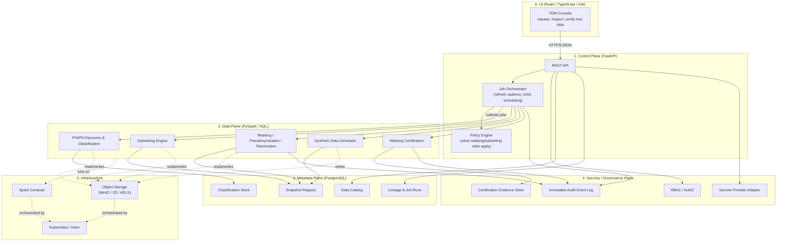

# Architecture

This document is the system design reference for the
**enterprise-healthcare-test-data-management-platform**. It is written for a
mixed audience — junior engineers who need to understand *why* the system is
shaped this way, and senior engineers who need the interface contracts between
components. If you are new to the project, read this before touching code.

## 1. Problem statement

Large regulated healthcare organizations run many lower environments (dev,
test, QA, performance, UAT, sandbox). Those environments need data that:

- **Looks and behaves like production** (realistic distributions, volumes,
  edge cases, referential relationships) so tests are meaningful, and
- **Contains no real PHI/PII** so a breach of a lower environment carries no
  regulatory or patient-safety consequence, and
- **Is refreshed on a predictable cadence** so it doesn't go stale, without
  blowing the storage/compute budget for lower environments, and
- **Can be proven safe** — an auditor, security reviewer, or compliance
  officer must be able to see evidence that a given data set was classified,
  masked, and certified before it reached a lower environment.

This is a *pipeline and governance* problem as much as a *data engineering*
problem. The architecture reflects that: every artifact the platform produces
(a subset, a masked table, a synthetic data set, a snapshot) carries metadata
that proves how it was produced and that it is safe to use.

## 2. The six planes

The system is decomposed into six planes. Each plane has a single
responsibility, a narrow public interface, and no reach-through into another
plane's internals. This is the most important architectural decision in the
repository (see [ADR-0003](docs/adr/0003-plane-separation.md)) — it is what
lets each plane be developed, tested, scaled, and reasoned about
independently, and it is what a real enterprise TDM platform requires because
the teams that own these concerns (data engineering, platform/SRE, security
& compliance, product) are usually different teams with different change
cadences.

### 2.1 Control plane (`services/control-plane`)

Owns orchestration and policy — it decides *what* should happen and *when*,
and enforces *who* is allowed to ask for it. It never touches raw data
directly; it submits jobs to the data plane and waits for results.

Responsibilities:

- Public REST API (FastAPI) for requesting subsets, masked datasets,
  synthetic datasets, snapshots, and refresh runs
- Job orchestration: translating a request into a DAG of data-plane jobs,
  tracking status, retrying, enforcing refresh cadence/schedules
- Policy engine: resolving which masking policy, subsetting rule, and
  certification requirement applies to a given source system / data
  classification combination
- Capacity awareness: consulting footprint/quota data before approving a job
  that would provision new storage/compute in a lower environment

Does **not** own: actual data transformation logic (data plane), the
system-of-record schema for catalogs/lineage (metadata plane owns the schema;
control plane is a client of it), or identity/authorization decisions beyond
enforcing decisions handed to it by the security/governance plane.

### 2.2 Data plane (`services/data-plane`)

Owns the actual movement and transformation of data. Every job here is
designed to be run either locally (small data, pandas-compatible path for
learning/tests) or on Spark (production-scale), and every job is designed to
be Databricks-compatible (i.e., it does not depend on anything that only
exists in a specific vendor's local Spark setup).

Responsibilities:

- **Discovery** (`data_plane/discovery`): scan source schemas/samples and
  classify columns (direct identifier, quasi-identifier, sensitive clinical
  attribute, non-sensitive) using rule-based + pattern-based detectors.
- **Subsetting** (`data_plane/subsetting`): given a source dataset and a
  sizing/business rule (e.g., "2% of patients, all related claims and
  encounters, at least 50 patients per rare condition"), produce a smaller
  dataset that preserves referential integrity across tables and systems.
- **Masking** (`data_plane/masking`, implemented in Phase 3): a
  policy-driven masking engine supporting redaction, nullification,
  unkeyed hashing, HMAC-based deterministic pseudonymization, a
  `TokenVault` tokenization abstraction, format-preserving synthetic
  replacement, date shifting, and named specializations (email/phone/
  address/name), engineered so the *same* real value always maps to the
  *same* masked value within a scope (preserving joinability across
  tables and across heterogeneous source systems) without being
  reversible without the secret key/token vault. Driven by the real
  Phase 2 catalog: a column's classification tier resolves to a masking
  rule (`data_plane/masking/policy.py`), which is how "catalog
  classification -> masking policy -> masked output" is wired end to
  end. See `docs/adr/0006-deterministic-masking-strategy.md` and
  `docs/adr/0010-masking-technique-vocabulary.md`.
- **Synthetic generation** (`data_plane/synthetic`, implemented in
  Phase 5): supplements an already-subsetted-and-masked dataset (or
  produces a standalone dataset) with wholly synthetic *scenario*
  records — no real source row involved at all — for specific test
  scenarios a QA/test engineer needs on demand (a high-cost claim, a
  claim referencing a member that doesn't exist, a member with an
  unusually large claim history, ...) that may not occur naturally, or
  often enough, in a random subset. Distinct from Phase 1's
  `data_plane/reference_data`, which builds the *entire* estate from
  nothing and injects its own edge cases as part of that build — this
  component runs one stage later in the pipeline (after `MASK`, per the
  diagram above) and only ever augments. Every record it produces (and
  every base-estate record it touches while augmenting) is tagged with
  an explicit `healthcare_tdm_contracts.DataProvenance`
  (`masked_production_like` / `synthetic` / `negative_test`) so a
  synthetic or negative-test record can never be mistaken for real
  (masked) data downstream. See
  `docs/tutorial/05-synthetic-scenario-generation.md`.
- **Certification** (implemented alongside masking): automated checks that a
  produced dataset actually meets its masking policy (no raw identifiers
  leaked, referential integrity holds, distribution shape preserved within
  tolerance) before it is allowed to be published as a snapshot.

### 2.3 Metadata plane (PostgreSQL, schema owned under `services/control-plane/src/control_plane/db` and `libs/contracts`)

The system of record. If it isn't in the metadata plane, it didn't happen.

Responsibilities:

- **Catalog**: known source systems, datasets, tables/columns, and their
  current classification.
- **Lineage & job runs**: every job that ran, its inputs, outputs, status,
  duration, and the policy version it used.
- **Snapshot registry**: every test-data snapshot ever produced — version,
  source job run, storage location, size, row counts, expiry/refresh policy.
- **Classification store**: the PHI/PII classification of every known column,
  with confidence score and who/what confirmed it.

### 2.4 Security / governance plane (`services/governance-service`)

Owns trust. Every other plane calls into this one to check permissions, emit
audit events, or resolve secrets — this plane never calls into the others.

Responsibilities:

- **RBAC**: role-based authorization decisions (e.g., who can request a
  subset containing a given classification tier, who can approve a masking
  policy change, who can view certification evidence).
- **Immutable audit event log**: an append-only record of security-relevant
  events (job requested, job approved, data published, policy changed,
  access granted). Designed so events cannot be edited or deleted through
  the application layer.
- **Secrets provider adapter**: a thin interface over environment variables
  locally and a real secret manager (e.g., AWS Secrets Manager, Azure Key
  Vault) in the cloud — application code never reads raw secrets directly.
- **Certification evidence store**: the durable record that a given snapshot
  passed its masking certification, referenced by auditors.

As of Phase 10, this service remains a structural scaffold (no
database, no FastAPI app) -- centralized masking *policy-version
governance* (who approved which masking policy version, which named
business consumers may reference it) was implemented in
`services/control-plane` instead, because it needed a same-transaction
integration with the control plane's own Phase 7/8 schema; see
[ADR-0014](docs/adr/0014-masking-governance-lives-in-control-plane.md).
*Who is authorized* to approve a policy version (RBAC) remains this
service's eventual, still-unbuilt responsibility.

### 2.5 UI (`frontend/`)

A React + TypeScript + Vite console for the people who consume this
platform day to day: engineers requesting test data, data stewards approving
classifications, auditors reviewing certification evidence. Talks to the
control plane only, over its public REST API — it has no direct access to
storage, the metadata database, or Spark.

### 2.6 Infrastructure (`infra/`)

- **Local development**: Docker Compose running PostgreSQL, MinIO
  (S3-compatible object storage), and (in later phases) a local Spark
  runtime.
- **Cloud storage adapters**: a common storage interface
  (`libs/contracts` defines the contract; each service implements an
  adapter) with implementations for MinIO (dev), AWS S3, and Azure
  Blob/ADLS, so the same job code runs unmodified in any environment. Extra
  adapters for other open-source healthcare data repositories are added as
  needed behind the same interface.
- **Kubernetes / Helm**: deployment shape for running the platform in a real
  cluster.
- **Terraform**: example infrastructure-as-code for provisioning the cloud
  resources (storage buckets, managed Postgres, secrets, IAM) in AWS and
  Azure. These are teaching examples, not a turnkey production deployment.

## 3. Cross-cutting concerns

### 3.1 Referential integrity across heterogeneous systems

The hardest problem this platform solves is keeping a *patient ID* (or claim
ID, encounter ID, provider NPI, etc.) consistent after masking — not just
within one table, but across every table and every source system that
references it. The design principle: masking of an identifier is a pure,
deterministic function of (real value, masking scope, secret salt/key). Two
jobs run against the same scope and key always produce the same masked value
for the same real value, so joins that worked in production still work after
masking, without ever storing a reversible mapping outside the governed token
vault. See [ADR-0006](docs/adr/0006-deterministic-masking-strategy.md).

### 3.2 Data quality

A subset or masked dataset is only useful if it is *shaped* like production:
similar distributions, similar rare-case coverage, similar volumes relative
to what a test needs. Data-quality checks are a first-class, automated gate
between "job produced output" and "output is published as a usable
snapshot" — not an afterthought.

### 3.3 Observability

Every plane emits structured logs (JSON, correlation-ID tagged), metrics
(job duration, rows processed, storage footprint, masking coverage), and
traces (a request through control plane → data plane → metadata plane is one
trace). Audit events (security/governance plane) are a distinct stream from
operational logs — audit events are evidence, not debugging output.

### 3.4 Disaster recovery

Snapshots are versioned and stored in object storage with the metadata
plane holding the authoritative index. Losing the metadata database is
recoverable (object storage retains data + a manifest sufficient to rebuild
the catalog); losing object storage is recoverable by re-running the
producing job from source, because every job run's inputs and policy version
are recorded in lineage. This "metadata + reproducibility" pattern is cheaper
than replicating multi-terabyte lower-environment datasets across regions,
and is documented further in `docs/runbooks/`.

## 4. Interfaces between planes (Phase 0 contract sketch)

These are the interfaces later phases will implement. They exist now as
typed contracts in `libs/contracts` and as route/module stubs, so the shape
of the system is fixed before behavior is added.

| Caller → Callee | Interface | Carried by |
|---|---|---|
| UI → Control plane | REST/JSON over HTTPS | `services/control-plane/src/control_plane/api` |
| Control plane → Data plane | Job submission contract (job type, source, policy ref, sizing rule) | `libs/contracts` `JobRequest` model |
| Data plane → Metadata plane | Lineage/catalog/snapshot writes | SQLAlchemy models in `control_plane/db`, shared row contracts in `libs/contracts` |
| Any plane → Security/governance plane | AuthZ check, audit event emit, secret resolve | `libs/contracts` `AuditEvent`, `AuthorizationRequest` models |
| Data plane → Infrastructure | Object storage get/put, Spark session | Storage adapter interface in `libs/contracts` / `data_plane` |

Phase 2 note: the PHI/PII data catalog (`Discovery` in the diagram above)
is implemented and real, but the metadata plane's PostgreSQL
catalog/classification store (row 3 above, per ADR-0004) does not exist
yet — that is later-phase infrastructure work. Until it does, discovery
writes the catalog as a JSON artifact and the control plane reads it
directly, both sides depending only on the shared `libs/contracts`
`CatalogEntry` shape, never on each other's package. See
[ADR-0009](docs/adr/0009-catalog-artifact-handoff.md) for the interim
design and what it does not yet solve (concurrent writers, live reload).

Phase 3 note: the `Masking` component in the diagram above is
implemented and real (`services/data-plane/src/data_plane/masking/`), and
reads the same JSON catalog artifact ADR-0009 describes to decide which
masking technique applies to which column — it does not talk to the
control plane's API to get there, it consumes the discovery CLI's
`catalog.json` output directly (both are data-plane-internal steps run
by the same CLI-driven workflow today; wiring masking as a job the
control plane's orchestrator submits is `JobType`/`Orchestrator` work for
a later phase). The `Masking` -> `Snapshots` edge and the `Masking` ->
`AuditLog` edge are not yet implemented — there is no snapshot registry
or audit event log to write to yet (both are later-phase metadata/
governance-plane infrastructure); Phase 3's masking runs write a plain
JSON run summary (`masking_run_summary.json`) next to the masked output
instead. See `problems_phase_03.md` P3-1 and P3-3.

Phase 4 note: the `Subsetting` component in the diagram above is
implemented and real
(`services/data-plane/src/data_plane/subsetting/`). Like `Discovery` and
`Masking` before it, it is run directly today
(`python -m data_plane.subsetting.cli`), not yet submitted as a job by
the control plane's orchestrator (`JobType.SUBSETTING` exists in
`libs/contracts` but nothing yet translates a `JobRequest.sizing_rule`
into a `SubsettingStrategy`/parameters — see `problems_phase_04.md`
P4-1). The `Subsetting` -> `Snapshots` edge and the audit-log edge are
not yet implemented for the same reason Phase 3 documents for masking:
there is no snapshot registry or audit event log to write to yet.
Subsetting runs write a plain JSON manifest (`subset_manifest.json`,
`healthcare_tdm_contracts.SubsetManifest`) next to the subset output
instead, following the same interim pattern Phase 3 established with
`masking_run_summary.json` — see `problems_phase_04.md` P4-2.

Phase 6 note: the `Certifier` component in the diagram above
(`services/data-plane/src/data_plane/certification/`) is implemented and
real, and it is the pipeline that actually runs the
`INGEST -> PROFILE -> CLASSIFY -> SUBSET -> MASK -> GENERATE OPTIONAL
SYNTHETIC DATA -> VALIDATE -> CERTIFY -> PUBLISH` sequence this document's
introduction describes, end to end, against a real generated estate --
see `docs/tutorial/06-certification-pipeline.md`. Like Phases 3/4/5
before it, it is run directly today
(`python -m data_plane.certification.cli`), not yet submitted as a job by
the control plane's orchestrator (`JobType.CERTIFICATION` exists in
`libs/contracts` but nothing yet translates a `JobRequest` into a
certification pipeline invocation -- see `problems_phase_06.md` P6-1).
The `Certifier -> Evidence` edge (security/governance plane) and the
`Certifier -> AuditLog` edge are not yet implemented for the same reason
Phases 3/4 document for their own edges: there is no certification
evidence store or audit event log to write to yet. A certification run
today writes a self-contained `certification_report.json`
(`healthcare_tdm_contracts.CertificationReport`), signed with a keyed
HMAC for tamper evidence (`data_plane.certification.signing`) rather than
relying on a governed evidence store, following the same interim pattern
Phase 3 established with `masking_run_summary.json` and Phase 4 with
`subset_manifest.json`. Critically, and unlike those two phases'
outputs, this report's own `status` field IS a real, enforced lifecycle
(`CertificationStatus`, `data_plane.certification.state_machine`) --
`ARCHITECTURE.md` section 2.2's requirement that a real certifier "must
not simply trust [masking's] own report" is what this phase's gates
(`data_plane/certification/gates.py`) exist to satisfy; see
`docs/CERTIFICATION_VS_MASKING.md` for the full reasoning.

Phase 7 note: this phase gives `services/control-plane` its first real,
database-backed piece of the metadata plane described in section 2.3 --
`control_plane/db/models.py` (dataset versions, refresh policies,
environment dataset requests, refresh runs, rollback events) and
`control_plane/domain/lifecycle/` (the business logic and the
`RefreshOrchestrator` orchestration abstraction), exposed at
`/api/v1/lifecycle`. Unlike every prior control-plane capability (the
Phase 2 catalog, a read-only view over a JSON artifact per ADR-0009),
this is real, writable, queryable state -- `EnvironmentDatasetRequest`
rows reference a `DatasetVersion` by foreign key rather than copying its
`storage_uri`, which is the concrete mechanism satisfying `ROADMAP.md`
Phase 7's "avoid unnecessary duplicate physical copies" requirement. See
[ADR-0012](docs/adr/0012-refresh-orchestration-abstraction.md) and
`docs/tutorial/07-dataset-lifecycle-and-refresh.md`. The catalog,
lineage, and classification-store portions of section 2.3's schema
remain not-yet-migrated from their Phase 2 JSON-artifact interim design
(see `problems_phase_07.md`, which does not reopen that gap -- it is
still tracked under its original Phase 2 owner note).

Phase 8 note: storage/compute capacity planning is split across two new,
additive modules rather than one -- `data_plane.capacity` (real, on-disk
footprint measurement: actual bytes, actual Parquet-vs-CSV compression
ratios, actual Hive-style partition layout) and
`control_plane.domain.capacity` (real, DB-backed aggregation over
Phase 7's `DatasetVersion`/`EnvironmentDatasetRequest` rows: naive-vs-
shared storage totals, per-environment compute-demand estimates, vacuum
candidates, plus a pure, configurable illustrative
percentage-of-production scenario model). This is a deliberate
plane-separation decision -- see
[ADR-0013](docs/adr/0013-capacity-planning-plane-split.md) -- and it
does not re-solve Phase 7's "avoid unnecessary duplicate physical
copies" requirement; it quantifies the savings that architecture already
produces, exposed at `/api/v1/capacity`. See
`docs/tutorial/08-storage-compute-capacity-planning.md` and
`docs/CAPACITY_COST_TRADEOFFS.md` for the honest, measured numbers and
what remains modeled/illustrative rather than measured.

Phase 9 note: `frontend/` (row 1 above, the UI plane) goes from an
empty Phase 0 scaffold to a real, working console -- fourteen
route-mounted pages, a typed API client layer (`frontend/src/api/`,
strict TypeScript interfaces mirroring the `libs/contracts` Pydantic
models), Vitest/React Testing Library component tests, and Playwright
E2E tests for the critical workflows, all talking only to the control
plane's REST API per this section's original constraint. Four of the
console's pages (Masking Policies, Subsetting Jobs, Synthetic Data,
Certification) needed a real backing API that did not exist yet --
Phases 3/4/5/6's engines only ever wrote a JSON artifact to disk (see
this document's own Phase 3/4/5/6 notes above). Rather than fake those
pages' data, this phase adds four new, small, read-only control-plane
routers (`control_plane/api/v1/masking.py`, `subsetting.py`,
`synthetic.py`, `certification.py`) backed by a new
`control_plane/artifacts/` package, following the *exact* JSON-artifact-
handoff pattern ADR-0009 established for the Phase 2 catalog: no
control-plane code imports `data_plane`, and the only coupling is the
shared `libs/contracts` shapes (`SubsetManifest`,
`SyntheticGenerationManifest`, `CertificationReport`) plus one small,
deliberately duplicated, control-plane-local mirror type for masking
(`MaskingRunSummary` -- masking's run summary was never promoted to a
`libs/contracts` shape, unlike the other three). Unlike the Phase 2
catalog's single configured artifact path, each of these four
repositories recursively scans a configured *root directory* for every
matching artifact filename found under it (real job/demo runs write to
different output directories per run) -- see
`control_plane/artifacts/__init__.py`'s module docstring and
`problems_phase_09.md` for the concurrency/performance caveats this
inherits from ADR-0009's original design. Audit Trail (Phase 13) and
full Platform Health (Phase 11, beyond the existing liveness-only
`/api/v1/health`) remain honest "not yet available" placeholders --
there is no security/governance-plane audit log or dependency-aware
readiness check to point at yet. See `problems_phase_09.md` for the
per-page decision record and `docs/adr/0008-frontend-stack.md`
(unchanged, since the accessible-by-default / control-plane-only
constraints it establishes are exactly what this phase followed).

Phase 10 note: centralized enterprise masking *governance* --
`MaskingPolicyVersion`/`PolicyApproval` (an approval workflow wrapping
Phase 3's real `MaskingPolicy`) and `BusinessConsumer`/
`ConsumerDatasetRequest` (named organizational arms requesting datasets
exclusively through an *approved* policy version) -- is implemented in
`control_plane.domain.governance`, exposed at `/api/v1/governance`. On
name alone this sounds like `services/governance-service` (section 2.4)
territory; it is not, for this phase's concrete scope -- see
[ADR-0014](docs/adr/0014-masking-governance-lives-in-control-plane.md)
for the full reasoning: `services/governance-service` remains a
structural scaffold (no database, no FastAPI app), and this phase's
hardest requirement -- a business consumer's demand must be scheduled
into Phase 7's *existing* refresh calendar and be visible in Phase 8's
*existing* capacity plan, not a parallel implementation -- needs a
same-transaction call into `LifecycleRepository`, which only a
same-service, same-`Session` integration can give it honestly.
`GovernanceRepository.fulfill_consumer_request` is that call, proven
end-to-end in `scripts/demo_phase10_governance.py` and
`docs/tutorial/09-centralized-masking-governance.md`. RBAC over who may
approve a policy version remains explicitly out of scope (tracked in
`problems_phase_10.md`) -- consistent with every other actor-attribution
field already in this service (e.g. `DatasetVersion.revoked_by`) having
no RBAC check behind it yet.

Phase 11 note: platform-integrity controls (`ROADMAP.md` Phase 11) --
readiness (`/api/v1/ready`, distinct from Phase 0's liveness-only
`/api/v1/health`), a real, enforced RBAC mechanism
(`control_plane.platform.rbac`), the first real wiring of the Phase 0
`AuditEvent` contract to a durable store (`control_plane.platform.audit`),
a dead-letter concept for isolated job failures
(`control_plane.platform.dead_letter`), a generic retry helper
(`control_plane.platform.retry`), real `Settings` field validation,
and eight real failure-injection tests -- are implemented in
`services/control-plane/src/control_plane/platform/`, on name alone
`services/governance-service` (section 2.4) territory, for the exact
same same-transaction reason ADR-0014 gives for Phase 10's governance
domain living in `services/control-plane`: see
[ADR-0015](docs/adr/0015-platform-integrity-controls-in-control-plane.md).
RBAC is deliberately enforced at the API router layer, not inside the
domain repositories underneath it -- ADR-0015 explains the concrete,
discovered reason (an audit-denial write inside a repository call that
then raises would be rolled back by `session_scope`'s blanket
exception handling). `docs/PLATFORM_INTEGRITY.md` is the honest,
control-by-control account of what was already real from earlier
phases (certification's state machine and HMAC signing, Phase 7's
rollback/revocation, Phase 10's approved-policy-only consumer
requests, Phase 3's masking idempotency and secret-missing handling)
versus what this phase genuinely adds, including one real gap found
and fixed (`LifecycleRepository.register_dataset_version` was not
idempotent under a duplicate call) and one real gap found and only
partially mitigated (a masking run that crashes mid-way now leaves a
checkable `_MASKING_RUN_INCOMPLETE.marker`, but individual
per-source-system files are still not written atomically -- see
`problems_phase_11.md` P11-1). Container health
(`HEALTHCHECK`) is documented as design intent only -- `infra/docker/`
has no application `Dockerfile` yet to attach one to (Phase 12).

## 5. Why this stack

See the ADRs in `docs/adr/` for the reasoning behind each major choice
(Python project layout, PostgreSQL for metadata, Delta/Parquet for data,
MinIO for local object storage, deterministic masking strategy, plane
separation). ADRs are the durable record of *why*; this document is the
durable record of *what*.
