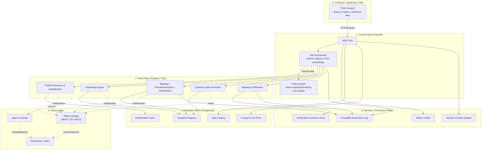

# Architecture

This document is the system design reference for the
**enterprise-healthcare-test-data-management-platform**. It is written for a
mixed audience — junior engineers who need to understand *why* the system is
shaped this way, and senior engineers who need the interface contracts between
components. If you are new to the project, read this before touching code.

## 1. Problem statement

Large regulated healthcare organizations run many lower environments (dev,
test, QA, performance, UAT, sandbox). Those environments need data that:

- **Looks and behaves like production** (realistic distributions, volumes,
  edge cases, referential relationships) so tests are meaningful, and
- **Contains no real PHI/PII** so a breach of a lower environment carries no
  regulatory or patient-safety consequence, and
- **Is refreshed on a predictable cadence** so it doesn't go stale, without
  blowing the storage/compute budget for lower environments, and
- **Can be proven safe** — an auditor, security reviewer, or compliance
  officer must be able to see evidence that a given data set was classified,
  masked, and certified before it reached a lower environment.

This is a *pipeline and governance* problem as much as a *data engineering*
problem. The architecture reflects that: every artifact the platform produces
(a subset, a masked table, a synthetic data set, a snapshot) carries metadata
that proves how it was produced and that it is safe to use.

## 2. The six planes

The system is decomposed into six planes. Each plane has a single
responsibility, a narrow public interface, and no reach-through into another
plane's internals. This is the most important architectural decision in the
repository (see [ADR-0003](docs/adr/0003-plane-separation.md)) — it is what
lets each plane be developed, tested, scaled, and reasoned about
independently, and it is what a real enterprise TDM platform requires because
the teams that own these concerns (data engineering, platform/SRE, security
& compliance, product) are usually different teams with different change
cadences.

### 2.1 Control plane (`services/control-plane`)

Owns orchestration and policy — it decides *what* should happen and *when*,
and enforces *who* is allowed to ask for it. It never touches raw data
directly; it submits jobs to the data plane and waits for results.

Responsibilities:

- Public REST API (FastAPI) for requesting subsets, masked datasets,
  synthetic datasets, snapshots, and refresh runs
- Job orchestration: translating a request into a DAG of data-plane jobs,
  tracking status, retrying, enforcing refresh cadence/schedules
- Policy engine: resolving which masking policy, subsetting rule, and
  certification requirement applies to a given source system / data
  classification combination
- Capacity awareness: consulting footprint/quota data before approving a job
  that would provision new storage/compute in a lower environment

Does **not** own: actual data transformation logic (data plane), the
system-of-record schema for catalogs/lineage (metadata plane owns the schema;
control plane is a client of it), or identity/authorization decisions beyond
enforcing decisions handed to it by the security/governance plane.

### 2.2 Data plane (`services/data-plane`)

Owns the actual movement and transformation of data. Every job here is
designed to be run either locally (small data, pandas-compatible path for
learning/tests) or on Spark (production-scale), and every job is designed to
be Databricks-compatible (i.e., it does not depend on anything that only
exists in a specific vendor's local Spark setup).

Responsibilities:

- **Discovery** (`data_plane/discovery`): scan source schemas/samples and
  classify columns (direct identifier, quasi-identifier, sensitive clinical
  attribute, non-sensitive) using rule-based + pattern-based detectors.
- **Subsetting** (`data_plane/subsetting`): given a source dataset and a
  sizing/business rule (e.g., "2% of patients, all related claims and
  encounters, at least 50 patients per rare condition"), produce a smaller
  dataset that preserves referential integrity across tables and systems.
- **Masking** (`data_plane/masking`): deterministic masking, pseudonymization,
  and tokenization, engineered so the *same* real value always maps to the
  *same* masked value within a scope (preserving joinability across tables
  and across heterogeneous source systems) without being reversible without
  the token vault.
- **Synthetic generation** (`data_plane/synthetic`): generate wholly synthetic
  records (no real source row involved at all) for scenarios where no safe
  source data exists (e.g., rare disease cohorts, edge-case volumes).
- **Certification** (implemented alongside masking): automated checks that a
  produced dataset actually meets its masking policy (no raw identifiers
  leaked, referential integrity holds, distribution shape preserved within
  tolerance) before it is allowed to be published as a snapshot.

### 2.3 Metadata plane (PostgreSQL, schema owned under `services/control-plane/src/control_plane/db` and `libs/contracts`)

The system of record. If it isn't in the metadata plane, it didn't happen.

Responsibilities:

- **Catalog**: known source systems, datasets, tables/columns, and their
  current classification.
- **Lineage & job runs**: every job that ran, its inputs, outputs, status,
  duration, and the policy version it used.
- **Snapshot registry**: every test-data snapshot ever produced — version,
  source job run, storage location, size, row counts, expiry/refresh policy.
- **Classification store**: the PHI/PII classification of every known column,
  with confidence score and who/what confirmed it.

### 2.4 Security / governance plane (`services/governance-service`)

Owns trust. Every other plane calls into this one to check permissions, emit
audit events, or resolve secrets — this plane never calls into the others.

Responsibilities:

- **RBAC**: role-based authorization decisions (e.g., who can request a
  subset containing a given classification tier, who can approve a masking
  policy change, who can view certification evidence).
- **Immutable audit event log**: an append-only record of security-relevant
  events (job requested, job approved, data published, policy changed,
  access granted). Designed so events cannot be edited or deleted through
  the application layer.
- **Secrets provider adapter**: a thin interface over environment variables
  locally and a real secret manager (e.g., AWS Secrets Manager, Azure Key
  Vault) in the cloud — application code never reads raw secrets directly.
- **Certification evidence store**: the durable record that a given snapshot
  passed its masking certification, referenced by auditors.

### 2.5 UI (`frontend/`)

A React + TypeScript + Vite console for the people who consume this
platform day to day: engineers requesting test data, data stewards approving
classifications, auditors reviewing certification evidence. Talks to the
control plane only, over its public REST API — it has no direct access to
storage, the metadata database, or Spark.

### 2.6 Infrastructure (`infra/`)

- **Local development**: Docker Compose running PostgreSQL, MinIO
  (S3-compatible object storage), and (in later phases) a local Spark
  runtime.
- **Cloud storage adapters**: a common storage interface
  (`libs/contracts` defines the contract; each service implements an
  adapter) with implementations for MinIO (dev), AWS S3, and Azure
  Blob/ADLS, so the same job code runs unmodified in any environment. Extra
  adapters for other open-source healthcare data repositories are added as
  needed behind the same interface.
- **Kubernetes / Helm**: deployment shape for running the platform in a real
  cluster.
- **Terraform**: example infrastructure-as-code for provisioning the cloud
  resources (storage buckets, managed Postgres, secrets, IAM) in AWS and
  Azure. These are teaching examples, not a turnkey production deployment.

## 3. Cross-cutting concerns

### 3.1 Referential integrity across heterogeneous systems

The hardest problem this platform solves is keeping a *patient ID* (or claim
ID, encounter ID, provider NPI, etc.) consistent after masking — not just
within one table, but across every table and every source system that
references it. The design principle: masking of an identifier is a pure,
deterministic function of (real value, masking scope, secret salt/key). Two
jobs run against the same scope and key always produce the same masked value
for the same real value, so joins that worked in production still work after
masking, without ever storing a reversible mapping outside the governed token
vault. See [ADR-0006](docs/adr/0006-deterministic-masking-strategy.md).

### 3.2 Data quality

A subset or masked dataset is only useful if it is *shaped* like production:
similar distributions, similar rare-case coverage, similar volumes relative
to what a test needs. Data-quality checks are a first-class, automated gate
between "job produced output" and "output is published as a usable
snapshot" — not an afterthought.

### 3.3 Observability

Every plane emits structured logs (JSON, correlation-ID tagged), metrics
(job duration, rows processed, storage footprint, masking coverage), and
traces (a request through control plane → data plane → metadata plane is one
trace). Audit events (security/governance plane) are a distinct stream from
operational logs — audit events are evidence, not debugging output.

### 3.4 Disaster recovery

Snapshots are versioned and stored in object storage with the metadata
plane holding the authoritative index. Losing the metadata database is
recoverable (object storage retains data + a manifest sufficient to rebuild
the catalog); losing object storage is recoverable by re-running the
producing job from source, because every job run's inputs and policy version
are recorded in lineage. This "metadata + reproducibility" pattern is cheaper
than replicating multi-terabyte lower-environment datasets across regions,
and is documented further in `docs/runbooks/`.

## 4. Interfaces between planes (Phase 0 contract sketch)

These are the interfaces later phases will implement. They exist now as
typed contracts in `libs/contracts` and as route/module stubs, so the shape
of the system is fixed before behavior is added.

| Caller → Callee | Interface | Carried by |
|---|---|---|
| UI → Control plane | REST/JSON over HTTPS | `services/control-plane/src/control_plane/api` |
| Control plane → Data plane | Job submission contract (job type, source, policy ref, sizing rule) | `libs/contracts` `JobRequest` model |
| Data plane → Metadata plane | Lineage/catalog/snapshot writes | SQLAlchemy models in `control_plane/db`, shared row contracts in `libs/contracts` |
| Any plane → Security/governance plane | AuthZ check, audit event emit, secret resolve | `libs/contracts` `AuditEvent`, `AuthorizationRequest` models |
| Data plane → Infrastructure | Object storage get/put, Spark session | Storage adapter interface in `libs/contracts` / `data_plane` |

## 5. Why this stack

See the ADRs in `docs/adr/` for the reasoning behind each major choice
(Python project layout, PostgreSQL for metadata, Delta/Parquet for data,
MinIO for local object storage, deterministic masking strategy, plane
separation). ADRs are the durable record of *why*; this document is the
durable record of *what*.
