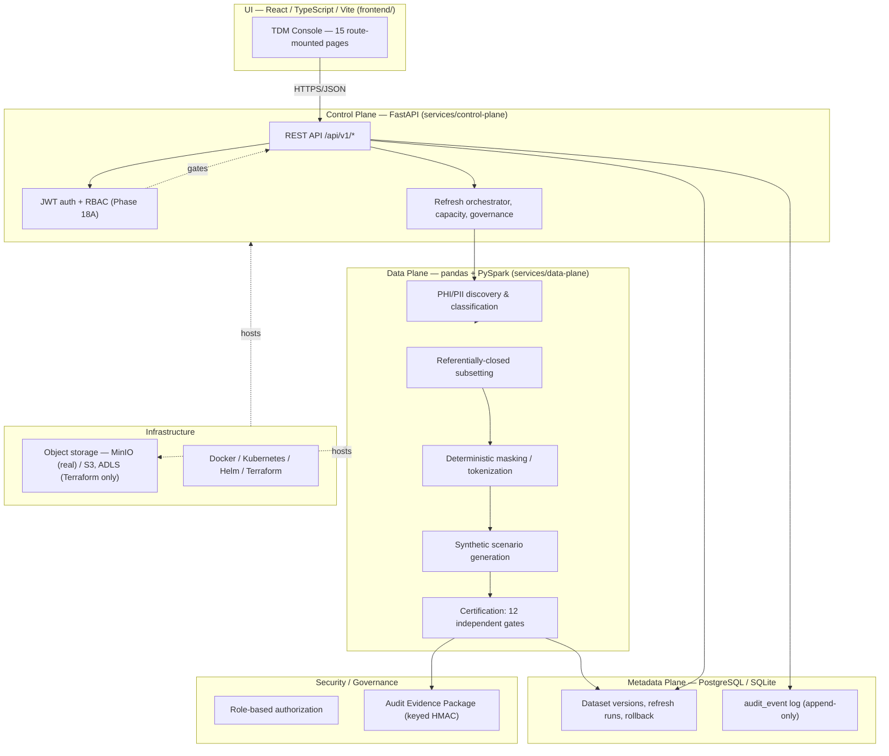

# Enterprise Healthcare Test Data Management Platform

A full-stack, portfolio-grade **Cloud Test Data Management (TDM) platform**
for regulated healthcare / life-sciences environments — built end to end
(React + FastAPI + PySpark, PHI/PII masking, subsetting, synthetic data,
certification, refresh orchestration, RBAC + JWT auth, Docker/K8s/Terraform,
CI/CD, audit evidence) across 18 build phases plus two fix/delete cycles.

> ### All healthcare records in this repository are synthetic.
> ### The repository contains no real PHI or PII.
>
> No real company, employer, client, insurer, or proprietary platform is
> referenced anywhere. This is a reference implementation and teaching
> artifact, not a deployed product, and **it is not HIPAA-certified and
> makes no claim of regulatory approval** — see [§19](#19-security-limitations-read-this-section)
> for exactly what is, and is not, real.

**Read this in under 3 minutes:** §1–§3 tell you what problem this solves
and what's real. §19 tells you, with equal honesty, what isn't. Everything
else is depth for whichever section you care about.

---

## Table of contents

1. [Enterprise problem](#1-enterprise-problem)
2. [Architecture diagram](#2-architecture-diagram)
3. [Core capabilities](#3-core-capabilities)
4. [Cloud Test Data Management](#4-cloud-test-data-management)
5. [PHI/PII masking](#5-phipii-masking)
6. [Referential integrity](#6-referential-integrity)
7. [Production-scale subsetting](#7-production-scale-subsetting)
8. [Synthetic generation](#8-synthetic-generation)
9. [Certified datasets](#9-certified-datasets)
10. [Refresh cadence](#10-refresh-cadence)
11. [Storage/compute optimization](#11-storagecompute-optimization)
12. [Platform integrity](#12-platform-integrity)
13. [Audit evidence](#13-audit-evidence)
14. [Technology stack](#14-technology-stack)
15. [Local quick start](#15-local-quick-start)
16. [Screenshots](#16-screenshots)
17. [Architecture decisions](#17-architecture-decisions)
18. [Testing strategy](#18-testing-strategy)
19. [Security limitations (read this section)](#19-security-limitations-read-this-section)
20. [Production deployment model](#20-production-deployment-model)
21. [Tutorial links](#21-tutorial-links)

---

## 1. Enterprise problem

Large regulated healthcare organizations run many lower environments (dev,
test, QA, performance, UAT). Those environments need data that:

- **Looks and behaves like production** — realistic distributions, volumes,
  and edge cases — so tests are actually meaningful.
- **Contains no real PHI/PII** — so a breach of a lower environment carries
  no regulatory or patient-safety consequence.
- **Refreshes on a predictable cadence** without blowing the lower-environment
  storage/compute budget.
- **Can be proven safe** — an auditor or security reviewer must be able to
  see evidence that a dataset was classified, masked, and certified before
  it reached a lower environment.

This is a *pipeline-and-governance* problem, not just a data-copying problem.
This repository is a from-scratch reference implementation of the platform
that solves it — end to end, against a real (synthetic) 14-entity, 5-source-
system healthcare estate, not a toy example. See `ARCHITECTURE.md` §1 for the
full problem statement this build follows.

**What this is not**, stated once, up front, so the rest of this document can
be read as engineering depth rather than a sales pitch: it is not connected
to any real organization, it is not a finished, deployed product, and it
does not certify anyone's regulatory compliance (§19, §20).

## 2. Architecture diagram

Six planes, kept intentionally decoupled so each can be built, tested, and
reasoned about independently — this is `ARCHITECTURE.md` §2's own diagram,
reused here (not redrawn) because a stale, inconsistent second diagram would
be worse than none. It renders natively on GitHub; the Mermaid source also
lives in `docs/diagrams/` (no separate PNG/SVG export exists — GitHub's
native rendering makes one unnecessary today; see `problems_master.md` P0-4).



For the "what's real vs. what's an intended seam" annotated version of this
same diagram (e.g. `services/governance-service` remains a structural
scaffold; its RBAC/audit/evidence responsibilities live in
`services/control-plane` today — [ADR-0014](docs/adr/0014-masking-governance-lives-in-control-plane.md)/[0015](docs/adr/0015-platform-integrity-controls-in-control-plane.md)/[0016](docs/adr/0016-audit-evidence-lives-in-control-plane.md)),
see `docs/interview/system-design.md` §2 or `ARCHITECTURE.md` §2 in full.

## 3. Core capabilities

| Capability | Status | Where |
|---|---|---|
| PHI/PII discovery & classification | Real | `services/data-plane/src/data_plane/discovery` |
| Deterministic masking / pseudonymization / tokenization | Real | `data_plane.masking` |
| Referentially-intact, production-scale subsetting | Real | `data_plane.subsetting` |
| Synthetic scenario generation | Real | `data_plane.synthetic` |
| Automated certification (12 gates) | Real | `data_plane.certification` |
| Dataset lifecycle, refresh cadence, rollback | Real | `control_plane.domain.lifecycle` |
| Storage/compute capacity planning | Real (+ one labeled illustrative model) | `control_plane.domain.capacity` |
| Centralized masking governance (multi-consumer) | Real | `control_plane.domain.governance` |
| RBAC + JWT authentication | Real, deliberately minimal (§19) | `control_plane.platform.auth`/`rbac` |
| Immutable audit log + evidence packages | Real | `control_plane.platform.audit`, `control_plane.domain.evidence` |
| React/TypeScript console (15 pages) | Real, mostly read-only (§19) | `frontend/` |
| PySpark jobs (masking, subsetting) at scale | Real, `local[*]` only | `data_plane.spark` |
| CI/CD, containers, Helm, Terraform | Real | `.github/workflows/`, `infra/` |
| Real MinIO/S3/ADLS storage adapter | **Not built** (§19) | — |
| Free-text/NLP PHI detection | **Not built** (§19) | — |

## 4. Cloud Test Data Management

"Cloud TDM" here means two things this platform actually does, not a
marketing category:

1. **Cloud-portable pipeline code.** Every data-plane job is written against
   `pandas`/local files by default and is designed to be re-platformed onto
   Spark without changing its logic — Phase 14 proves this for masking and
   subsetting specifically, with real measured PySpark throughput (`local[*]`
   only — see `docs/SCALE_AND_PERFORMANCE.md`). No vendor-specific Spark API
   is used anywhere, so the same job code is Databricks-compatible in the
   literal sense.
2. **Cloud-shaped infrastructure, provided as teaching examples.** Local
   development runs Docker Compose (PostgreSQL + MinIO); `infra/terraform/aws`
   and `infra/terraform/azure` are real, `terraform validate`-clean examples
   (the Azure one provisions AKS, a managed Postgres, an ADLS Gen2 account,
   ACR, and Key Vault); `infra/k8s/helm/tdm-platform` is a real, `helm lint`-
   clean chart for the three containerized services. None of this has ever
   been applied against a real cloud subscription.

**The one honest gap this section exists to name up front:** no real
MinIO/S3/ADLS *client* code exists in either service yet — every job still
reads/writes a local filesystem path directly (`problems_master.md` P0-3,
open since Phase 0; §19 below). "Cloud-portable" describes the job logic and
the provisioning examples; it does not yet describe a live storage
integration.

## 5. PHI/PII masking

`data_plane.masking.engine.MaskingEngine` implements a policy-driven engine
supporting redaction, nullification, unkeyed hashing, HMAC-based
deterministic pseudonymization, a `TokenVault` tokenization abstraction,
format-preserving synthetic replacement, date shifting, and named
specializations (email/phone/address/name). The design principle: masking is
a pure, deterministic function of `(real_value, scope, secret_key)` — the
same real value always maps to the same masked value within a scope, without
ever storing a reversible mapping outside the governed token vault. A
column's Phase 2 catalog classification tier resolves to a masking rule
(`data_plane.masking.policy`), so "catalog classification → masking policy →
masked output" is wired end to end, driven by real classification data, not
a hand-picked example. See [ADR-0006](docs/adr/0006-deterministic-masking-strategy.md)
and [ADR-0010](docs/adr/0010-masking-technique-vocabulary.md).

## 6. Referential integrity

The hardest problem this platform solves: keeping a patient/claim/encounter/
provider identifier consistent after masking — not just within one table,
but across every table and every one of the 5 heterogeneous source systems
that reference it. `data_plane.masking.policy.LINKAGE_SCOPES` maps every
system's own name for the same real-world entity (e.g. a partner feed's
legacy `pat_id` alias) onto one shared masking scope, so a member ID masks
to the *identical* token in the Postgres-shaped source, the Parquet lake, the
NDJSON clinical lake, the CSV PBM extract, and the partner JSON feed alike.
`data_plane.certification.gates.check_referential_integrity` independently
re-derives integrity at certification time rather than trusting masking's own
report — the platform's general rule that a later pipeline stage never
trusts an earlier stage's self-report (`docs/CERTIFICATION_VS_MASKING.md`).

## 7. Production-scale subsetting

`data_plane.subsetting` selects a small, referentially-closed slice of a
production-shaped estate, anchored at `Member`, via six strategies
(`percentage`, `fixed_population`, `stratified`, `date_window`,
`business_rule`, `risk_edge_case` — `healthcare_tdm_contracts.SubsettingStrategy`).
`data_plane.subsetting.closure` walks the relationship graph so every
claim/encounter/diagnosis reachable from a selected member comes along, and
nothing else does — every orphan reference the closure produces is classified
as an `engine_bug`, a `source_orphan`, or a deliberate `negative_test_injection`,
never left ambiguous. Phase 14 reimplements the same closure concept in
PySpark as two broadcast joins (never shuffling the large table) — see
`docs/SCALE_AND_PERFORMANCE.md`'s real captured `BroadcastHashJoin` physical
plan.

## 8. Synthetic generation

`data_plane.synthetic` augments an already-subsetted, already-masked dataset
with wholly synthetic *scenario* records — a high-cost claim, a claim
referencing a member that doesn't exist, a member with an unusually large
claim history — for test scenarios that may not occur naturally, or often
enough, in a random subset. Every record it produces (and every base-estate
record it touches while augmenting) is tagged with an explicit
`healthcare_tdm_contracts.DataProvenance` (`masked_production_like` /
`synthetic` / `negative_test`) so a synthetic or negative-test record can
never be mistaken for real (masked) data downstream. `data_plane.reference_data`
is the distinct, earlier-stage package that builds the *entire* synthetic
estate from nothing (all data anywhere in this repository is synthetic, not
just this stage's output — see the banner at the top of this document).

## 9. Certified datasets

No masked/synthetic dataset is ever published without passing an automated
certification pipeline that independently re-checks the *final* output —
never trusting an earlier stage's own report of success. This is the real
`INGEST → PROFILE → CLASSIFY → SUBSET → MASK → GENERATE OPTIONAL SYNTHETIC
DATA → VALIDATE → CERTIFY → PUBLISH` pipeline
(`data_plane.certification.pipeline.run_certification_pipeline`), enforced by
a real, tested six-state lifecycle (`DRAFT → PROCESSING → CERTIFIED/FAILED →
PUBLISHED/REVOKED`) and twelve independent gates: PHI/PII policy coverage,
masking completion, referential integrity, orphan detection, schema
validation, data-quality thresholds, row-count reconciliation, provenance,
manifest generation, policy-version recorded, masking-version recorded, and
distribution-shape (Phase 18A). The resulting `certification_report.json` is
signed with a keyed HMAC-SHA256 for tamper evidence — a real, executed run of
this exact pipeline is captured verbatim in [`DEMO.md`](DEMO.md). See
`docs/CERTIFICATION_VS_MASKING.md` for the five concrete ways "masking ran
cleanly" can still be unsafe to publish, which this design defends against.

## 10. Refresh cadence

`control_plane.domain.lifecycle` gives every environment a runtime-
configurable refresh cadence (`PUT /api/v1/lifecycle/refresh-policies`, never
hardcoded) — this repository's own example environments run DEV/QA weekly,
SIT biweekly, UAT release-driven, and PERFORMANCE monthly/on-demand.
`RefreshOrchestrator` (an abstract two-method seam — [ADR-0012](docs/adr/0012-refresh-orchestration-abstraction.md))
is what a real external scheduler (Airflow, a Databricks Workflow, a
Kubernetes CronJob) would plug into; `LocalRefreshOrchestrator` is the real,
tested in-process implementation exposed at `GET /api/v1/lifecycle/scheduler/due`
and `POST /api/v1/lifecycle/scheduler/run-due` (RBAC-gated, Phase 18A, and
protected against overlapping sweeps by a real database-enforced lock,
Phase 18B — `control_plane.platform.scheduler_lock`). Rollback and revocation
are real, enforced state transitions, not just reporting.

## 11. Storage/compute optimization

`EnvironmentDatasetRequest.current_version_id` is a foreign key into
`DatasetVersion` — requesting a dataset into a new environment never copies
`storage_uri`, it points at the version that already exists. This is
quantified, not just asserted: a real run of `scripts/demo_phase8_capacity.py`
against five environments sharing one registered dataset version measured a
**80.0% storage saving** (2,341,005 bytes naive vs. 468,201 bytes actual) —
real arithmetic over real registered rows, not a projection.
`control_plane.domain.capacity` also exposes a real, configurable
*illustrative* percentage-of-production scenario model (clearly labeled as
illustrative, not measured) for capacity questions this repository has never
run real data through (e.g. "Production: 100 TB, QA 10%, SIT 5%, UAT 15%" —
see `docs/CAPACITY_COST_TRADEOFFS.md`). `CapacityPlanner.vacuum_candidates`
identifies dataset versions nobody references any more but is deliberately
read-only — no storage adapter exists yet to delete through (§19).

## 12. Platform integrity

Real RBAC enforcement backed by a real, deliberately minimal JWT identity
layer (§19, [ADR-0018](docs/adr/0018-minimal-jwt-identity-layer-for-rbac.md));
a real, append-only audit event log with no update/delete code path
(`control_plane.platform.audit`); readiness (`GET /api/v1/ready`, checks the
database dependency, not just liveness) distinct from a bare liveness probe;
a dead-letter concept for isolated job failures; atomic per-file masking
writes (a crash mid-write leaves no truncated file at its final path,
Phase 18A); Postgres connection-pool resilience (`pool_pre_ping`,
`pool_recycle`, Phase 18B); a real Alembic migration framework
(Phase 18A) rather than `create_all`-only schema management. `docs/PLATFORM_INTEGRITY.md`
is the full, control-by-control account, including one real gap found and
fixed (a non-idempotent dataset-version registration call) and one found and
only partially mitigated during Phase 11's own failure-injection testing.

## 13. Audit evidence

Two real, database-backed mechanisms composed into one export.
`control_plane.platform.audit.AuditLogRepository` is the append-only trail
wired into every real lifecycle/governance mutation this repository has
built — dataset registration/revocation, refreshes/rollbacks, policy
approvals/rejections, consumer requests, RBAC denials themselves — read-only
via `GET /api/v1/audit/events`. `control_plane.domain.evidence.EvidenceRepository.build_evidence_package`
aggregates the real dataset manifest, classification summary, masking policy
version + approval history, provisioning/refresh/rollback/revocation
history, and the relevant audit trail into one
`AuditEvidencePackage`, integrity-protected by a keyed HMAC-SHA256 bundle
checksum (Phase 18A — `docs/TAMPER_EVIDENCE_LIMITATIONS.md`), exposed at
`POST /api/v1/evidence/dataset-versions/{version_id}/package`. **The load-
bearing honesty, carried verbatim in every generated package's own
`compliance_disclaimer` field:** this package supports an organization's own
compliance program — it is **not** itself a HIPAA (or any other) certification,
attestation, or guarantee. See `docs/COMPLIANCE_EVIDENCE.md` in full.

## 14. Technology stack

| Layer | Technology |
|---|---|
| Frontend | React 18, TypeScript, Vite, React Router, Vitest, Playwright |
| Control plane | Python, FastAPI, Pydantic v2, SQLAlchemy, Alembic, PyJWT |
| Data engineering | pandas, PySpark 4.2 (`local[*]`), PyArrow, Parquet |
| Metadata store | PostgreSQL (production-portable) / SQLite (local dev, CI) |
| Object storage | MinIO (local dev, real); AWS S3 / Azure Blob-ADLS (Terraform examples only — no client adapter yet, §19) |
| Infra | Docker Compose, Kubernetes, Helm, Terraform (AWS + Azure) |
| Testing | pytest, Vitest + React Testing Library, Playwright E2E |
| CI/CD | GitHub Actions (lint, typecheck, unit, integration, data-quality, security, container build/scan, staged deploy gate) |
| Security tooling | Custom secrets scanner, `pip-audit`, `npm audit`, Trivy image scanning |
| Observability | Structured JSON request logging + correlation IDs (control plane only — no metrics/tracing backend, §19) |

## 15. Local quick start

Every command below was run in this environment while writing this document
(Windows, Git Bash) — see [`DEMO.md`](DEMO.md) for the full, real, captured
output of an end-to-end run. Commands use POSIX shell syntax
(`export VAR=val`); PowerShell users, use `$env:VAR = 'val'` instead.

```bash
# 0. One-time: install every Python workspace package in editable mode.
./scripts/bootstrap.sh          # or scripts\bootstrap.ps1 on Windows PowerShell

# 1. Start the control plane (SQLite by default — no Postgres/Docker needed
#    for a local demo).
cd services/control-plane
export TDM_CONTROL_PLANE_JWT_SIGNING_KEY=$(python -m control_plane.platform.auth --generate-dev-key)
python -m uvicorn control_plane.main:app --port 8000
# -> GET http://localhost:8000/api/v1/health  => {"status":"ok",...}

# 2. In a second terminal, log in as a seeded synthetic demo identity and
#    call a real, RBAC-gated endpoint (see docs/adr/0018 for what this
#    identity layer does and does not cover):
curl -s -X POST http://localhost:8000/api/v1/auth/login \
  -H "Content-Type: application/json" \
  -d '{"username":"demo.platform_admin","password":"platform-admin-demo-pw-syn-5"}'

# 3. In a third terminal, run the real end-to-end certification pipeline
#    (generates a synthetic estate, subsets it, masks it, injects two
#    synthetic scenarios, runs 12 independent certification gates, publishes):
cd services/data-plane
python -m data_plane.certification.cli --generate-dev-key
export TDM_MASKING_HMAC_KEY=<printed masking key>
export TDM_CERTIFICATION_HMAC_KEY=<printed certification key>
python -m data_plane.certification.cli --scale tiny --seed 42 \
  --out-dir data/tmp/certification-run --strategy fixed_population --param count=10 \
  --scenario high_cost_claims --scenario invalid_claim_references --publish

# 4. Start the React console (talks only to the control plane's REST API):
cd frontend
npm install
npm run dev
# -> http://localhost:5173, proxying /api to the control plane on :8000
```

For the full walkthrough — including registering that certification report
as a real dataset version, and a live 401 → 403 → 200 RBAC demonstration —
see [`DEMO.md`](DEMO.md). Run the full test suite: `python -m pytest -q` in
each of `libs/contracts`, `services/control-plane`, `services/data-plane`,
`services/governance-service`, and `npm test -- --run` in `frontend/`.

## 16. Screenshots

**No screenshot images are included in this repository as of this release.**
This is a decision, not an oversight: capturing real screenshots would have
required standing up a headless browser against real seeded data as a one-off
artifact for this phase, and this repository's own discipline throughout
(`CONTRIBUTING.md`, every `docs/*_LIMITATIONS.md`) is to never claim an
artifact exists that wasn't actually produced. Instead, here is what a
reader would actually see at each of the console's 15 pages — every one
backed by a real API call, per `frontend/src/pages/README.md` (the
authoritative, per-page source-of-truth this table is drawn from):

| Page | Route | What's real |
|---|---|---|
| Dashboard | `/` | Live tiles composed from catalog/lifecycle/masking/certification/capacity APIs |
| Data Sources | `/data-sources` | Real Phase 2 catalog, grouped by source system |
| Data Catalog | `/catalog` | Real, filterable PHI/PII catalog |
| Sensitive Data Discovery | `/discovery` | Real catalog, data-steward review lens |
| Masking Policies | `/masking` | Real `GET /api/v1/masking/runs` |
| Subsetting Jobs | `/subsetting` | Real `GET /api/v1/subsetting/manifests` |
| Synthetic Data | `/synthetic` | Real `GET /api/v1/synthetic/manifests` |
| Certification | `/certification` | Real `GET /api/v1/certification/reports` |
| Datasets | `/datasets` | Real `GET /api/v1/lifecycle/dataset-versions` |
| Dataset detail | `/datasets/:versionId` | Composed from 4 real endpoints |
| Environment Provisioning | `/environments` | Real Phase 7 environment requests (read-only, §19) |
| Refresh Calendar | `/refresh-calendar` | Real Phase 7 refresh policies/schedule |
| Capacity & Cost | `/capacity` | Real capacity plan + one clearly labeled illustrative scenario |
| Audit Trail | `/audit-trail` | Real `GET /api/v1/audit/events`, filterable table (Phase 18A) |
| Platform Health | `/platform-health` | Real liveness/readiness endpoints |

## 17. Architecture decisions

Nineteen ADRs in `docs/adr/` are the durable record of *why* — `ARCHITECTURE.md`
is the durable record of *what*. The ones most worth reading first:
[0003](docs/adr/0003-plane-separation.md) (why six planes, enforced
structurally, not just by convention), [0006](docs/adr/0006-deterministic-masking-strategy.md)
(deterministic masking over true anonymization — the referential-integrity
tradeoff), [0009](docs/adr/0009-catalog-artifact-handoff.md) (JSON-artifact
plane handoff, the pattern reused by three later phases),
[0012](docs/adr/0012-refresh-orchestration-abstraction.md) (the scheduler
seam a real Airflow/Databricks/K8s CronJob would plug into),
[0014](docs/adr/0014-masking-governance-lives-in-control-plane.md)/[0015](docs/adr/0015-platform-integrity-controls-in-control-plane.md)/[0016](docs/adr/0016-audit-evidence-lives-in-control-plane.md)
(why `services/governance-service` stays a scaffold while its intended
responsibilities live in `services/control-plane`, for the same
same-transaction reason each time), and
[0018](docs/adr/0018-minimal-jwt-identity-layer-for-rbac.md)/[0019](docs/adr/0019-governed-vs-ungoverned-dataset-version-registration.md)
(the Phase 18A security fixes). `docs/interview/tradeoffs.md` walks through
each decision's actual tradeoff, cited to the ADR and the problems entry that
recorded it.

## 18. Testing strategy

788 backend tests (pytest) + 40 frontend tests (Vitest/RTL), 0 failing, run
fresh for this release — see [`RELEASE_CHECKLIST.md`](RELEASE_CHECKLIST.md)
for the exact, just-executed counts per package. The strategy, by layer:

- **Unit tests** per engine (masking, subsetting, discovery, certification
  gates, capacity, lifecycle state machines) against real logic, not mocks
  of it.
- **Integration tests** against a real SQLite-backed database (control
  plane) and, in CI, a real Postgres container.
- **Data-quality tests**: real referential-integrity checks, real masking
  validation, real certification-gate assertions against a real generated
  estate — not fixtures standing in for real pipeline output.
- **Failure-injection tests** (Phase 11): eight real, engineered failure
  scenarios and their real recovery mechanisms (dead-letter isolation, atomic
  writes, rollback), documented further in `docs/interview/failure-scenarios.md`.
- **Frontend**: Vitest/React Testing Library component tests plus Playwright
  E2E specs for the critical read-path workflows.
- **Security**: a custom secrets scanner and `pip-audit`/`npm audit`, both
  gating the CI release-gate job.
- **A deliberate, once-executed CI failure experiment** (Phase 12) proving
  the release gate actually blocks a broken build, not just documents that
  it should.

## 19. Security limitations (read this section)

This is the most important section in this document. The platform is
honestly, currently at this state — not overstated, not understated:

- **RBAC is real and enforced, backed by a real but deliberately minimal
  JWT layer.** `POST /api/v1/auth/login` (`control_plane.platform.auth`,
  Phase 18A) issues a signed, short-lived JWT for one of **five fixed,
  publicly-documented synthetic demo identities** — one per role. This is
  **not a production identity provider**: no user database, no self-service
  provisioning, no password reset, no MFA, no OAuth/OIDC federation, no
  session revocation list. It closes the specific gap it closes (a real
  caller-verified identity behind an authorization decision, for exactly
  five endpoints: dataset-version revoke, environment rollback,
  policy-version approve/reject, scheduler run-due) and does not claim to be
  more — see [ADR-0018](docs/adr/0018-minimal-jwt-identity-layer-for-rbac.md).
  Every other actor-attribution field in the platform (`requested_by`,
  `generated_by`, `accessed_by`, and every mutation with no RBAC gate at
  all) remains unverified, advisory free text.
- **Tamper evidence is real HMAC signing, detection-only, with a
  key-colocation risk.** Both the certification-report signature and the
  evidence-package checksum are keyed HMAC-SHA256 (Phase 18A closed the
  inconsistency where one used to be unkeyed). Neither is a prevention
  mechanism, and neither is a non-repudiation signature: anyone with **both**
  database/file write access **and** the signing key can forge a
  self-consistent edit. Closing that needs a real external KMS/HSM
  integration this repository does not implement. See
  `docs/TAMPER_EVIDENCE_LIMITATIONS.md` for the single canonical statement of
  this.
- **No real object-storage adapter exists anywhere.** Every job reads/writes
  a local filesystem path directly — there is no MinIO/S3/ADLS client code
  in either service. `CapacityPlanner.vacuum_candidates` can *identify* dead
  dataset versions but cannot delete them through anything real.
- **No free-text/NLP-based PHI detection exists.** Classification is
  regex/schema-based only; none of the 14 reference entities has a free-text
  clinical-note field, so the hardest real-world PHI detection case has
  never been exercised. See `docs/PHI_PII_CLASSIFICATION_LIMITATIONS.md`.
- **The console is mostly read-only.** No in-UI write workflow exists for
  any lifecycle/governance mutation (revoke, rollback, policy approval,
  consumer-request fulfillment) — every one of those is real at the API
  layer and exercised only by scripts/tests today.
- **No rate limiting or request quota enforcement exists anywhere.** A flood
  of job requests has no mitigation; capacity planning is a read-only
  reporting capability, never wired as a gate on request submission.
- **No real metrics or distributed tracing exists.** Structured JSON request
  logging with correlation IDs is real, but only in `services/control-plane`
  — no equivalent in `services/data-plane`/`services/governance-service`,
  and no Prometheus/OpenTelemetry backend anywhere.

**The authoritative, current, line-item list is
[`problems_final_review.md`](problems_final_review.md) — 11 findings (6 P2,
5 P3), every one re-verified as of Phase 18B**, each with its own reasoning
for why it remains open rather than being fabricated shut. This README
summarizes that file; it does not compete with it — if the two ever
disagree, `problems_final_review.md` is the current source of truth.

## 20. Production deployment model

This repository has **never been deployed**. What exists is real,
cloud-*shaped* infrastructure intended as teaching material for adapting to
a real deployment, not a turnkey production target:

- Real, minimal, multi-stage Dockerfiles for the three containerizable
  services (`services/control-plane`, `services/governance-service`,
  `frontend`) — `data-plane` is deliberately not containerized (it is a
  batch/CLI toolkit with no long-running process to containerize yet).
- Real GitHub Actions CI/CD (`ci.yml` → `container-build.yml`/`e2e.yml` →
  `deploy-qa.yml` → `deploy-staging-uat.yml` → `deploy-production.yml`,
  chained via `workflow_run`), where every "deploy" target is a Docker
  Compose stand-in with real health checks — explicitly not a real cloud
  environment.
- Real, `helm lint`-clean Kubernetes manifests (`infra/k8s/helm/tdm-platform`)
  and a real, `terraform validate`-clean Azure example (AKS, managed
  Postgres, ADLS Gen2, ACR, Key Vault — `docs/AZURE_PRODUCTION_DEPLOYMENT.md`)
  plus a lighter AWS Terraform example — neither ever applied against a real
  subscription.
- **This platform is not HIPAA-certified and makes no claim of regulatory
  approval.** The Audit Evidence Package (§13) supports an organization's
  own compliance program; it is not itself a certification. A real
  production deployment would need, at minimum, a real identity provider
  (replacing §19's minimal JWT layer), a real storage adapter, a real
  KMS/HSM for signing keys, real metrics/tracing, and a real external
  scheduler with its own concurrency control — every one of these is named
  honestly above and in `problems_final_review.md`, not silently assumed.

## 21. Tutorial links

- **New to Test Data Management entirely?** Start with
  [`docs/tutorial/guide/README.md`](docs/tutorial/guide/README.md) — a
  complete, 20-chapter, zero-to-understanding-this-repository tutorial
  (Phase 15), each chapter teaching a concept from first principles before
  linking to the matching implementation-depth chapter below.
- **Implementation-depth chapters** (assume TDM vocabulary already):
  [`docs/tutorial/00-overview.md`](docs/tutorial/00-overview.md) and
  `docs/tutorial/01`–`09`, `13` (planes and data flow, synthetic data
  estate, PHI/PII classification, subsetting and referential closure,
  synthetic scenarios, the certification pipeline, dataset lifecycle and
  refresh, storage/compute capacity planning, centralized masking
  governance, auditability and compliance evidence).
- **Interview / system-design material** (`docs/interview/`):
  [`system-design.md`](docs/interview/system-design.md) (how a senior
  engineer whiteboards this),
  [`tradeoffs.md`](docs/interview/tradeoffs.md) (every deliberate tradeoff,
  cited to its ADR), [`failure-scenarios.md`](docs/interview/failure-scenarios.md)
  (real failure injection and recovery), and
  [`scaling.md`](docs/interview/scaling.md) (the 500 TB / 50-team / Databricks
  questions, answered honestly about what's measured vs. modeled).
- **A live, tested, interview-ready walkthrough**: [`DEMO.md`](DEMO.md).
- **The full build history**: [`ROADMAP.md`](ROADMAP.md) (phase-by-phase
  "what was actually delivered") and [`CHANGELOG.md`](CHANGELOG.md).

---

See [`LICENSE`](LICENSE) (MIT). See [`CONTRIBUTING.md`](CONTRIBUTING.md) for
the phase-based development process this repository was built with, and
[`SECURITY.md`](SECURITY.md)/[`THREAT_MODEL.md`](THREAT_MODEL.md)/[`DATA_GOVERNANCE.md`](DATA_GOVERNANCE.md)
for the governing rules behind every claim in §19.
