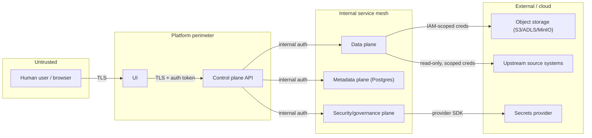

# Threat Model

A STRIDE-based threat model for the Enterprise Cloud Test Data Management
platform. This was written at the architecture level (Phase 0) and is
revisited below for the first time since then (Phase 18A -- see section
5). The goal is to teach *how* to threat-model a system like this, not
just to list findings.

**Phase 18A revisit note.** `docs/problems/problems_final_review.md` P1-1 found that
this document had not been touched since its Phase 0 commit despite
Phases 7, 10, 11, and 13 all changing real trust boundaries, and as a
result made at least three claims that no longer matched the real
codebase: a "token-based auth... on every request" mitigation that did
not exist anywhere, a capacity-planning DoS mitigation that was never
wired to any request-submission endpoint, and a "Phase 15" citation for
work actually done in Phase 8. The Control plane and Infrastructure
sections below are corrected accordingly. Where Phase 18A closed a real
gap (identity verification for RBAC), the mitigation now describes the
real, minimal mechanism that exists (`control_plane.platform.auth`,
ADR-0018) rather than an aspirational one; where a gap remains open
(quota/rate-limiting), the mitigation is honestly removed rather than
left standing as a false claim.

## 1. Assets

| Asset | Why it matters |
|---|---|
| Source system credentials/connection info | Compromise gives access to real production-shaped source systems |
| The masking key/salt material | Compromise breaks the "non-reversible" guarantee of masked data |
| The token vault (real-value ↔ token mapping) | The single most sensitive artifact in the platform if it ever existed with real data; in this repo it only ever holds synthetic data |
| Classification metadata | Tells an attacker exactly which columns are sensitive, i.e. a map of "what to steal" |
| Audit event log | If tampered with, an organization loses its ability to prove compliance |
| Certification evidence | If forged, a dataset could be presented as "safe" when it is not |
| Masked/synthetic datasets in lower environments | Lower blast radius by design, but still a target if masking is weak |

## 2. Trust boundaries

This diagram describes the target-state design: every arrow crossing a
boundary should be an authenticated, authorized call, and no plane
should trust a caller's claim about identity without independent
verification. **As of Phase 18A, this is real for exactly five
endpoints** (dataset-version revoke, environment rollback,
policy-version approve/reject, and scheduler run-due -- see
`control_plane.platform.auth`/`rbac`, ADR-0018) and remains aspirational
for every other User->UI->API arrow and every internal service-to-service
arrow shown above (there is no mutual-TLS or service-identity mechanism
between planes in this repository at all). This is a portfolio/teaching
repository using only synthetic data, never deployed -- see section 4.

## 3. STRIDE analysis by plane

### Control plane

- **Spoofing**: a caller claims a role/identity it doesn't have.
  *Mitigation (real, as of Phase 18A)*: `POST /api/v1/auth/login` issues a
  signed JWT for one of a small set of seeded, SYNTHETIC demo identities;
  every RBAC-gated mutation (dataset-version revoke, environment
  rollback, policy-version approve/reject, scheduler run-due) verifies
  that token's signature/expiry and derives the role it authorizes
  against from the verified claim (`control_plane.platform.auth`,
  ADR-0018) -- never from a caller-supplied request field. **Honest
  scope limit**: this is a deliberately minimal mechanism (a handful of
  fixed demo users, no self-service provisioning, no MFA, no OAuth/OIDC
  federation), not a production identity provider -- see
  `control_plane.platform.auth`'s own module docstring and ADR-0018. It
  closes the specific gap this section used to (falsely) claim was
  closed; it does not claim to be a hardened, general-purpose auth
  system. Every non-role actor-attribution field in this platform
  (`revoked_by`, `performed_by`, `requested_by`, `generated_by`,
  `accessed_by`) remains **unverified, advisory metadata, not a security
  control** -- see `control_plane.platform.rbac`'s module docstring and
  `docs/problems/problems_final_review.md` P2-13.
- **Tampering**: a job request is modified in transit or a replayed request
  re-triggers an already-approved job.
  *Mitigation*: TLS everywhere; job requests are idempotency-keyed.
- **Repudiation**: a user denies having requested a dataset containing a
  sensitive classification tier.
  *Mitigation*: every approval-worthy action emits an immutable audit event
  before the action is allowed to proceed. See the caveat above: the
  audit event's `actor` field is unverified free text, so this mitigates
  "there is no record at all," not "the record cannot name the wrong
  person."
- **Information disclosure**: API error messages leak internal schema or
  data details.
  *Mitigation*: documented error contract that never echoes raw data values.
- **Denial of service**: a flood of job requests exhausts data-plane
  compute. **No mitigation exists for this today** -- Phase 8's
  `CapacityPlanner` (`control_plane.domain.capacity`) is a read-only
  reporting/estimation API, never wired as a gate on
  `POST /api/v1/lifecycle/environment-requests` or any other
  request-submission endpoint, and no rate limiting exists anywhere in
  this codebase (confirmed by a repo-wide grep for
  `RateLimit|rate_limit|slowapi|Throttl`). This is an open, real gap for
  a genuine production deployment, tracked as `docs/problems/problems_final_review.md`
  P1-1's own finding rather than papered over with an aspirational
  mitigation.
- **Elevation of privilege**: a low-privilege role requests an action gated
  to a higher role by manipulating a request payload.
  *Mitigation (real, as of Phase 18A)*: authorization decisions
  (`control_plane.platform.rbac.authorize`) are made server-side, against
  a role derived from a verified bearer token (see "Spoofing" above) --
  no longer inferred from a client-supplied `actor_role` field. This
  covers exactly the four endpoints RBAC gates plus scheduler run-due
  (`docs/problems/problems_final_review.md` P1-2); every other lifecycle/governance
  mutation remains ungated by role at all (`docs/problems/problems_phase_11.md` P11-4),
  a distinct, still-open gap from the one this mitigation closes.

### Data plane

- **Tampering**: a masking job is altered to skip a column, leaving an
  identifier unmasked.
  *Mitigation*: masking policy is fetched from the metadata plane at job
  start and hashed into the job's lineage record; certification
  independently re-checks output against the policy, not against what the
  job claims it did.
- **Information disclosure**: a bug causes raw source data to be written to
  an intermediate location without masking.
  *Mitigation*: subsetting and masking are staged so raw extracts live only
  in a short-lived, access-restricted staging area that is never the
  publishable snapshot location; certification blocks promotion out of
  staging.
- **Denial of service**: a subsetting job with a pathological sizing rule
  attempts to pull an entire production-scale table.
  *Mitigation*: sizing rules are validated and capped by policy before
  execution.

### Metadata plane

- **Tampering**: classification records are altered to hide that a column
  is sensitive.
  *Mitigation*: classification changes are themselves audited events with
  actor and justification; sensitive-tier downgrades require a second
  approver (a governance workflow implemented in a later phase).
- **Information disclosure**: the metadata database itself becomes a target
  because it maps out exactly where sensitive data lives.
  *Mitigation*: the metadata plane holds classification labels and
  structural metadata — never actual PHI/PII values.

### Security / governance plane

- **Repudiation**: audit events are deleted or edited after the fact.
  *Mitigation*: append-only storage pattern for the audit log; the
  application layer exposes no update/delete path for audit events.
- **Spoofing**: a service forges an audit event to appear as if an approval
  happened.
  *Mitigation*: internal service-to-service auth (mutual trust established
  via the platform's internal auth mechanism, detailed in a later-phase ADR).
- **Elevation of privilege**: secrets provider misconfiguration grants a
  service more access than it needs.
  *Mitigation*: least-privilege IAM scoping per service, documented per
  adapter.

### UI

- **Spoofing / session hijacking**: a stolen session token is reused.
  *Mitigation*: short-lived tokens, TLS-only cookies/headers (implementation
  detail for the phase that builds auth).
- **Information disclosure**: the UI renders a preview of "masked" data that
  accidentally shows unmasked values due to a client-side bug.
  *Mitigation*: the UI never receives raw data — the control plane API
  contract only returns already-masked/aggregated preview data, so there is
  no raw value for a UI bug to leak.

### Infrastructure

- **Tampering / disclosure**: object storage bucket misconfigured as public.
  *Mitigation*: Terraform examples default to private buckets with explicit,
  documented exceptions; this is called out in the Terraform README.
- **Denial of service**: lower-environment compute/storage grows unbounded.
  *Mitigation*: footprint/capacity management (Phase 8 --
  `control_plane.domain.capacity`, corrected from this document's
  previous, incorrect "Phase 15" citation; Phase 15 is the
  junior-engineer tutorial, an unrelated phase) computes retention/vacuum
  candidates and illustrative quota scenarios. As noted in the Control
  plane section above, this is a reporting capability, not yet an
  enforced gate on request submission -- the mitigation here is
  "an operator has the data needed to act," not "the system prevents
  unbounded growth automatically."

## 4. Explicit non-goals / accepted risk in this repository

- This repository does not implement a real KMS/HSM — it documents the
  interface a real one would plug into and assumes the platform operator
  provides it.
- This repository does not implement network-layer controls (VPC design,
  firewall rules) — those are infrastructure-operator responsibilities
  documented at a high level in the Terraform examples, not enforced by
  application code.
- Because no real data ever enters this repository, several of the above
  mitigations are demonstrated structurally (interfaces, tests, audit
  events) rather than against a live attacker. The threat model is written
  as if this were production-bound, which is the point of the exercise.

## 5. Revisit cadence

This document is revisited at the end of every phase that changes a trust
boundary (e.g., adding a new plane-to-plane call, adding a new external
integration). Revisions are noted in the relevant ADR, not by silently
editing history in this file.

**Revisit history**: Phase 0 (initial write). Phase 18A (this revisit --
`docs/problems/problems_final_review.md` P1-1): corrected the Control plane Spoofing/
Denial-of-service/Elevation-of-privilege mitigations and the
Infrastructure Denial-of-service citation to match the real codebase;
see ADR-0018 for the identity-verification mechanism this revisit
documents. `git log --oneline -- THREAT_MODEL.md` before this revisit
showed exactly one commit (Phase 0) across Phases 1-17 -- a real gap in
this document's own stated discipline, now closed for this revisit and
worth checking again at the end of Phase 18B and every phase after.
