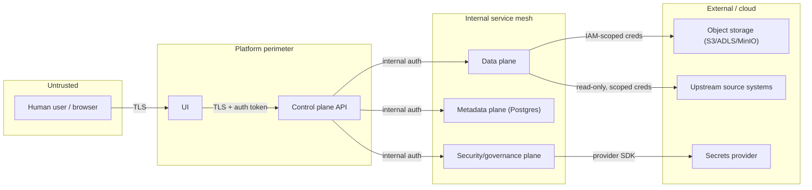

# Threat Model

A STRIDE-based threat model for the Enterprise Cloud Test Data Management
platform. This is written at the architecture level (Phase 0); it will be
revisited and made concrete as each plane is implemented. The goal is to
teach *how* to threat-model a system like this, not just to list findings.

## 1. Assets

| Asset | Why it matters |
|---|---|
| Source system credentials/connection info | Compromise gives access to real production-shaped source systems |
| The masking key/salt material | Compromise breaks the "non-reversible" guarantee of masked data |
| The token vault (real-value ↔ token mapping) | The single most sensitive artifact in the platform if it ever existed with real data; in this repo it only ever holds synthetic data |
| Classification metadata | Tells an attacker exactly which columns are sensitive, i.e. a map of "what to steal" |
| Audit event log | If tampered with, an organization loses its ability to prove compliance |
| Certification evidence | If forged, a dataset could be presented as "safe" when it is not |
| Masked/synthetic datasets in lower environments | Lower blast radius by design, but still a target if masking is weak |

## 2. Trust boundaries

Every arrow crossing a boundary is an authenticated, authorized call. No
plane trusts a caller's claim about identity without verifying it through
the security/governance plane.

## 3. STRIDE analysis by plane

### Control plane

- **Spoofing**: a caller claims a role/identity it doesn't have.
  *Mitigation*: token-based auth validated against the security/governance
  plane on every request; no plane trusts a header value alone.
- **Tampering**: a job request is modified in transit or a replayed request
  re-triggers an already-approved job.
  *Mitigation*: TLS everywhere; job requests are idempotency-keyed.
- **Repudiation**: a user denies having requested a dataset containing a
  sensitive classification tier.
  *Mitigation*: every approval-worthy action emits an immutable audit event
  before the action is allowed to proceed.
- **Information disclosure**: API error messages leak internal schema or
  data details.
  *Mitigation*: documented error contract that never echoes raw data values.
- **Denial of service**: a flood of job requests exhausts data-plane
  compute.
  *Mitigation*: control plane enforces quota/footprint checks before
  submitting jobs (see ADR on capacity planning, added in a later phase).
- **Elevation of privilege**: a low-privilege role requests an action gated
  to a higher role by manipulating a request payload.
  *Mitigation*: authorization decisions are made server-side by the
  security/governance plane, never inferred from client-supplied fields.

### Data plane

- **Tampering**: a masking job is altered to skip a column, leaving an
  identifier unmasked.
  *Mitigation*: masking policy is fetched from the metadata plane at job
  start and hashed into the job's lineage record; certification
  independently re-checks output against the policy, not against what the
  job claims it did.
- **Information disclosure**: a bug causes raw source data to be written to
  an intermediate location without masking.
  *Mitigation*: subsetting and masking are staged so raw extracts live only
  in a short-lived, access-restricted staging area that is never the
  publishable snapshot location; certification blocks promotion out of
  staging.
- **Denial of service**: a subsetting job with a pathological sizing rule
  attempts to pull an entire production-scale table.
  *Mitigation*: sizing rules are validated and capped by policy before
  execution.

### Metadata plane

- **Tampering**: classification records are altered to hide that a column
  is sensitive.
  *Mitigation*: classification changes are themselves audited events with
  actor and justification; sensitive-tier downgrades require a second
  approver (a governance workflow implemented in a later phase).
- **Information disclosure**: the metadata database itself becomes a target
  because it maps out exactly where sensitive data lives.
  *Mitigation*: the metadata plane holds classification labels and
  structural metadata — never actual PHI/PII values.

### Security / governance plane

- **Repudiation**: audit events are deleted or edited after the fact.
  *Mitigation*: append-only storage pattern for the audit log; the
  application layer exposes no update/delete path for audit events.
- **Spoofing**: a service forges an audit event to appear as if an approval
  happened.
  *Mitigation*: internal service-to-service auth (mutual trust established
  via the platform's internal auth mechanism, detailed in a later-phase ADR).
- **Elevation of privilege**: secrets provider misconfiguration grants a
  service more access than it needs.
  *Mitigation*: least-privilege IAM scoping per service, documented per
  adapter.

### UI

- **Spoofing / session hijacking**: a stolen session token is reused.
  *Mitigation*: short-lived tokens, TLS-only cookies/headers (implementation
  detail for the phase that builds auth).
- **Information disclosure**: the UI renders a preview of "masked" data that
  accidentally shows unmasked values due to a client-side bug.
  *Mitigation*: the UI never receives raw data — the control plane API
  contract only returns already-masked/aggregated preview data, so there is
  no raw value for a UI bug to leak.

### Infrastructure

- **Tampering / disclosure**: object storage bucket misconfigured as public.
  *Mitigation*: Terraform examples default to private buckets with explicit,
  documented exceptions; this is called out in the Terraform README.
- **Denial of service**: lower-environment compute/storage grows unbounded.
  *Mitigation*: footprint management (Phase 15) enforces quotas and expiry
  on snapshots.

## 4. Explicit non-goals / accepted risk in this repository

- This repository does not implement a real KMS/HSM — it documents the
  interface a real one would plug into and assumes the platform operator
  provides it.
- This repository does not implement network-layer controls (VPC design,
  firewall rules) — those are infrastructure-operator responsibilities
  documented at a high level in the Terraform examples, not enforced by
  application code.
- Because no real data ever enters this repository, several of the above
  mitigations are demonstrated structurally (interfaces, tests, audit
  events) rather than against a live attacker. The threat model is written
  as if this were production-bound, which is the point of the exercise.

## 5. Revisit cadence

This document is revisited at the end of every phase that changes a trust
boundary (e.g., adding a new plane-to-plane call, adding a new external
integration). Revisions are noted in the relevant ADR, not by silently
editing history in this file.
