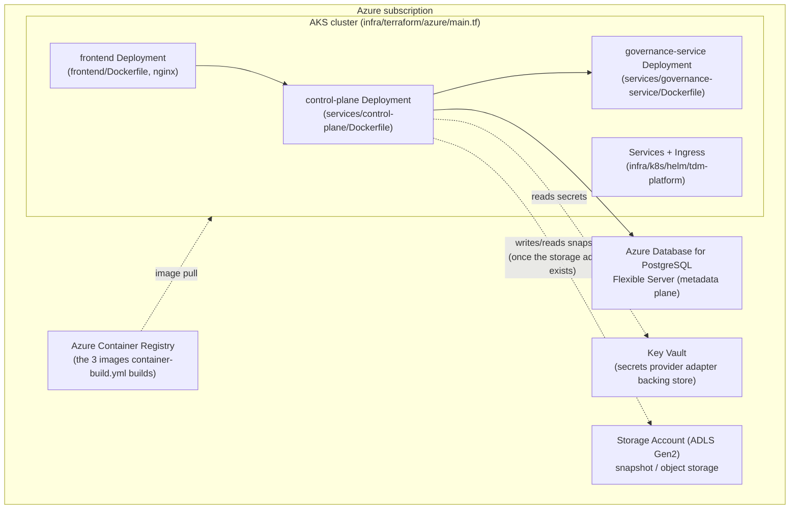

# Azure production deployment (while staying cloud-portable)

This document is Phase 12's answer to `ROADMAP.md`'s "Document
Azure-oriented production deployment while maintaining cloud-portable
architecture" requirement. It describes what a real production
deployment of this platform on Azure looks like, using the real
artifacts this phase produced (`services/*/Dockerfile`,
`infra/docker/docker-compose.yml`, `infra/k8s/helm/tdm-platform/`,
`infra/terraform/azure/main.tf`) — and is explicit, throughout, about
which pieces are genuinely Azure-specific versus which pieces this
platform's existing architecture (ADR-0003 plane separation, ADR-0005
storage-adapter abstraction) already keeps portable to any cloud.

No step in this document was executed against a real Azure
subscription. `infra/terraform/azure/main.tf` was validated with
`terraform fmt -check` and `terraform validate` only (see
`problems_phase_12.md` for the exact commands and output) — never
`terraform plan`/`apply`. No Azure credential exists anywhere in this
repository or its CI workflows.

## 1. The deployment shape

Every box above corresponds to a real file in this repository:

| Box | Real artifact |
|---|---|
| control-plane / governance-service / frontend Deployments | `infra/k8s/helm/tdm-platform/templates/{control-plane,governance-service,frontend}-deployment.yaml` |
| Services + Ingress | `infra/k8s/helm/tdm-platform/templates/{*-service,ingress}.yaml` |
| Images | `services/control-plane/Dockerfile`, `services/governance-service/Dockerfile`, `frontend/Dockerfile` — built (not pushed) by `.github/workflows/container-build.yml` |
| AKS / ACR / Postgres / Storage / Key Vault | `infra/terraform/azure/main.tf` |

## 2. What is genuinely Azure-specific

- **`infra/terraform/azure/main.tf`** — every resource block
  (`azurerm_kubernetes_cluster`, `azurerm_postgresql_flexible_server`,
  `azurerm_storage_account`, `azurerm_container_registry`,
  `azurerm_key_vault`, the `azurerm_role_assignment`s between them) is
  Azure's own resource model and Azure RBAC. None of it is portable
  Terraform — an AWS deployment uses a structurally different (though
  conceptually equivalent) set of resources; see `infra/terraform/aws/main.tf`'s
  own comments for the AWS-side name of each equivalent
  (`aws_eks_cluster`, `aws_db_instance`, `aws_s3_bucket`,
  `aws_secretsmanager_secret`, ...).
- **Azure Database for PostgreSQL Flexible Server** — a managed
  Postgres offering specific to Azure (connection string shape,
  firewall rules, flexible-server-specific `sku_name` tiers). The
  *database itself* (schema, migrations, SQLAlchemy models in
  `control_plane.db.models`) is 100% portable — see section 3.
- **Azure Container Registry (ACR)** and the `AcrPull` role assignment
  granting AKS's managed identity pull access — Azure's own registry
  and IAM model. A real deployment's CI pipeline would add a `docker
  push` step to `container-build.yml` targeting this registry (not
  present today — see `problems_phase_12.md`).
- **Key Vault** and the `Key Vault Secrets User` role assignment —
  Azure's own secret-manager product and RBAC model.
- **Azure Application Gateway Ingress Controller (AGIC)**, referenced
  in `infra/k8s/helm/tdm-platform/templates/ingress.yaml`'s comments as
  the expected `ingressClassName` — Azure's own L7 ingress controller.
  Any other `IngressClass` (nginx-ingress, etc.) works with the same
  Ingress manifest; the manifest itself is not Azure-specific, only the
  `ingressClassName` value a real deployment sets is.

## 3. What stays cloud-portable (and why)

This is the part `ROADMAP.md` cares about most, and it is a direct
consequence of decisions already made in earlier phases — Phase 12
did not have to invent portability, only prove it against a second
cloud's worth of Terraform:

- **Plane separation ([ADR-0003](adr/0003-plane-separation.md))**:
  control-plane, data-plane, and governance-service are independent
  processes with a narrow public interface between them. Nothing about
  how they talk to each other (REST/JSON, `libs/contracts` shapes)
  changes based on which cloud they run in. The three real Dockerfiles
  this phase added build the exact same image regardless of target
  cloud — `services/control-plane/Dockerfile` has zero Azure-specific
  content; only the *values* Helm is given at install time
  (`--set controlPlane.image.repository=<registry>/tdm-control-plane`)
  differ between an ACR-backed and an ECR-backed deployment.
- **PostgreSQL as the metadata-plane engine
  ([ADR-0004](adr/0004-postgresql-metadata-store.md))**: the schema
  (`control_plane.db.models`), migrations, and every domain repository
  built on top of it (`control_plane.domain.lifecycle`, `.capacity`,
  `.governance`, `.platform`) are pure SQLAlchemy against a standard
  PostgreSQL wire protocol. Section 5 of `infra/docker/docker-compose.yml`'s
  own verification (this phase's real Postgres-container run, see
  `problems_phase_12.md`) is the same code path Azure Database for
  PostgreSQL, RDS Postgres, or a self-managed Postgres pod would all
  exercise identically — only `TDM_CONTROL_PLANE_LIFECYCLE_DATABASE_URL`
  changes.
- **The storage-adapter interface
  ([ADR-0005](adr/0005-object-storage-abstraction.md))**: MinIO
  (local), AWS S3, and Azure Blob/ADLS are meant to be interchangeable
  behind one interface, with job code (subsetting, masking, synthetic
  generation) written only against that interface. **Honest status as
  of Phase 12**: this interface is still a design contract, not
  implemented code — see `problems_master.md` P0-3, still open. Every
  data-plane job today reads/writes a local filesystem path directly
  (`data_plane.reference_data.writers`, etc.), not through a storage
  adapter. `infra/terraform/azure/main.tf`'s
  `azurerm_storage_account`/`azurerm_storage_container` provisions the
  *target* this adapter will eventually write to (ADLS Gen2-enabled,
  matching the Parquet/Delta-partitioned layout the data plane already
  produces locally), but nothing in this phase makes the data plane
  actually use it yet. This is the single largest portability gap this
  document is honest about, not the one it claims to have closed.
- **Kubernetes/Helm as the deployment abstraction**: `infra/k8s/helm/tdm-platform`
  is a standard Helm chart with no cloud-provider-specific API objects
  (no Azure CRDs). It runs unmodified against AKS, EKS, GKE, or a local
  `kind`/`minikube` cluster — only `values.yaml`'s image
  repositories/registry and (optionally) the Ingress class differ.
- **Docker Compose as the integration-environment baseline**: the same
  `infra/docker/docker-compose.yml` this phase verified against a real
  Postgres container locally is also exactly what
  `.github/workflows/deploy-qa.yml`/`deploy-staging-uat.yml`/`deploy-production.yml`
  run in CI as their (explicitly documented) stand-in for a real
  deployment target — the same containers, built from the same
  Dockerfiles, that a real AKS deployment runs.

## 4. Secrets

`ARCHITECTURE.md` section 2.4 describes the secrets provider adapter as
"a thin interface over environment variables locally and a real secret
manager ... in the cloud." Concretely, on Azure:

- Local dev / CI: environment variables (`TDM_CONTROL_PLANE_DATABASE_URL`,
  etc.), as `infra/docker/docker-compose.yml` and every CI workflow in
  this phase already do.
- Real Azure deployment: `infra/terraform/azure/main.tf`'s
  `azurerm_key_vault.tdm`, read by AKS pods via the Key Vault Provider
  for Secrets Store CSI Driver (or an External Secrets Operator synced
  Kubernetes `Secret`) into the exact `Secret` shape
  `infra/k8s/helm/tdm-platform/templates/secret.yaml` already expects
  (`controlPlane.databaseSecretName`) — that template's `create: false`
  default is precisely this: expect the Secret to already exist,
  populated by Azure's own secret pipeline, never by a value templated
  into this chart. This is still design documentation, not implemented
  code — `services/governance-service`'s real secrets-provider-adapter
  code is unbuilt (see `ARCHITECTURE.md` section 2.4).

## 5. What a real rollout would add (not done here)

- `container-build.yml` gains a `docker push` step to ACR, gated behind
  real `AZURE_CLIENT_ID`/`AZURE_TENANT_ID`/federated-credential OIDC
  login (never a long-lived secret) — GitHub's `azure/login` action
  supports this without a stored password.
- `deploy-qa.yml`/`deploy-staging-uat.yml`/`deploy-production.yml`'s
  Docker-Compose-stand-in steps are replaced with a real `helm upgrade
  --install` against the real AKS cluster's kubeconfig (obtained via
  `azure/aks-set-context`), keeping the exact same `needs:`/
  `workflow_run`/environment-protection gate structure these workflows
  already have — see `problems_phase_12.md` for confirmation that gate
  structure was proven for real, independent of the deploy target.
- A real remote Terraform backend (`backend "azurerm" {}`, commented
  out in `main.tf` today) and a `terraform plan`/`apply` pipeline with
  a human-approved plan step.
- The storage-adapter implementation this section 3 flags as the
  remaining portability gap (`problems_master.md` P0-3).
