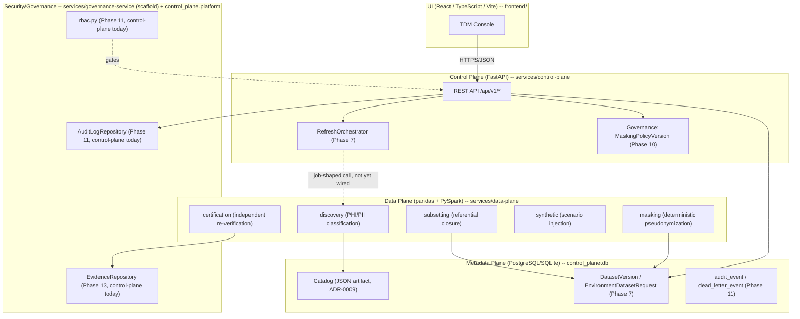

# System design: how a senior engineer would whiteboard this platform

This is the answer to "walk me through how you'd design an enterprise
healthcare test-data-management (TDM) platform" as it applies to *this
repository specifically* — every claim below names the real module, ADR, or
test that backs it. It is not generic system-design-interview material; a
generic answer would talk about "a masking service" and "an orchestrator" in
the abstract. This one names `data_plane.masking.dataset_masker.mask_estate`,
`control_plane.domain.lifecycle.LifecycleRepository`, and the exact tests
that prove each claim, because that is what distinguishes "I know the
pattern" from "I built the pattern."

See `docs/interview/tradeoffs.md` for the deliberate tradeoffs behind each
decision below, `docs/interview/failure-scenarios.md` for what happens when
a stage in this pipeline fails, and `docs/interview/scaling.md` for how this
whiteboard scales past a laptop.

## 1. Start with the problem, not the architecture

A senior engineer does not start at "six microservices." They start at the
actual constraint (`ARCHITECTURE.md` section 1): lower environments need
data that (a) looks like production, (b) contains no real PHI/PII, (c)
refreshes on a cadence without blowing the storage budget, and (d) can be
*proven* safe to an auditor after the fact. Every architectural decision
below is in service of one of those four things — if a design choice in this
repository doesn't trace back to one of them, that's worth questioning.

## 2. The six planes, and why the whiteboard has six boxes, not one



This is `ARCHITECTURE.md` section 2's diagram, redrawn to show what's real
today versus what's an intended seam. The interview-relevant point: **this
repository never violates the plane boundary to move faster.** When Phase
10's masking governance needed a same-transaction call into Phase 7's
lifecycle machinery, the answer was not "have `governance-service` call
`control-plane`'s HTTP API and hope it's eventually consistent" — it was
"put the new domain in the same service, same `Session`" and write down why
in [ADR-0014](../adr/0014-masking-governance-lives-in-control-plane.md).
[ADR-0015](../adr/0015-platform-integrity-controls-in-control-plane.md) and
[ADR-0016](../adr/0016-audit-evidence-lives-in-control-plane.md) make the
identical call for Phase 11's platform-integrity controls and Phase 13's
audit evidence, for the identical reason. A senior engineer explaining this
system says out loud: "the security/governance plane in `ARCHITECTURE.md`
section 2.4 is a design target; as of Phase 13 its real, transactional
implementation lives inside `services/control-plane`, because that's where
the data it must join against actually lives — `services/governance-service`
remains the honest structural scaffold it always was
(`services/governance-service/src/governance_service/`)." That is a more
credible answer than pretending a six-box diagram is six running services.

The one plane-separation rule enforced structurally, not just by
convention, per [ADR-0003](../adr/0003-plane-separation.md): `data_plane`
and `control_plane` are separate installable packages (`pyproject.toml` per
service, [ADR-0002](../adr/0002-python-project-layout.md)) with no dependency
edge between them — `services/control-plane` never imports `data_plane`.
`docs/diagrams/plane-dependency.mmd` draws this explicitly, including the
forbidden edges (`NOT ALLOWED: DP -> SGP direct import, DP -> CP direct
import, any service -> service import`).

## 3. The pipeline: nine stages, one after another, never trust-chained

```
INGEST -> PROFILE -> CLASSIFY -> SUBSET -> MASK ->
GENERATE OPTIONAL SYNTHETIC DATA -> VALIDATE -> CERTIFY -> PUBLISH
```

This is the sequence `data_plane.certification.pipeline.run_certification_pipeline`
actually executes end to end against a real generated estate (see
`docs/tutorial/06-certification-pipeline.md`), not an aspirational diagram —
`docs/diagrams/data-flow-sequence.mmd` is the companion sequence diagram
(a single snapshot request traced plane by plane). Every stage is
implemented by a distinct data-plane package that only knows its own job:

| Stage | Package | What it actually does |
|---|---|---|
| INGEST | `data_plane.reference_data` | Generates/reads the 14-entity, 5-source-system synthetic estate |
| PROFILE + CLASSIFY | `data_plane.discovery` | Three-layer classification: `schema_rules.py`, `pattern_rules.py`, `overrides.py` |
| SUBSET | `data_plane.subsetting` | Referentially-closed selection anchored at `Member`, six strategies (`selection.py`) |
| MASK | `data_plane.masking` | Deterministic, keyed pseudonymization (`dataset_masker.mask_estate`) |
| GENERATE (optional) | `data_plane.synthetic` | Injects eleven scenario types, tagged with `DataProvenance` |
| VALIDATE + CERTIFY | `data_plane.certification` | Eleven independent gates (`gates.py`), enforced state machine |
| PUBLISH | `control_plane.domain.lifecycle` | `LifecycleRepository.register_dataset_version` (`CERTIFIED`/`PUBLISHED` only) |

The single most important design principle in this pipeline, and the one an
interviewer is really probing for: **a later stage never trusts an earlier
stage's own report of success — it independently re-derives its answer.**
`docs/CERTIFICATION_VS_MASKING.md` states this explicitly and names five
concrete ways "masking ran cleanly" (`masking_run_summary.json`'s
`validation_passed: true`) can still be unsafe to publish — e.g. masking
ran against an incomplete classification (a column discovery missed), or a
referential-integrity break was introduced by *subsetting*, a different
stage than the one that would report it. `data_plane.certification.gates.check_phi_pii_policy_coverage`
independently re-resolves the masking policy against every catalog column
rather than trusting masking's own exit code; `check_referential_integrity`
independently re-derives integrity rather than trusting Phase 3's own
`data_plane.masking.validation`. This is the concrete implementation of
"defense in depth" a whiteboard session should show as *distinct boxes with
arrows*, not one box labeled "safety checks."

## Q: How do you preserve referential integrity while masking identifiers?

**Answer, grounded in this repo:** masking is a pure, deterministic, keyed
function — `masked = f(real_value, scope, secret_key)` — per
[ADR-0006](../adr/0006-deterministic-masking-strategy.md), implemented in
`data_plane.masking.engine.MaskingEngine`. The same real member ID produces
the identical masked token everywhere it appears *within a scope*, so joins
that worked in production keep working after masking, without ever storing
a reversible mapping outside a governed vault. The concrete mechanism that
makes this hold across *heterogeneous source systems* (not just within one
table) is `data_plane.masking.policy.LINKAGE_SCOPES` — a cross-system
linkage-scope table that maps, e.g., the partner feed's legacy `pat_id`
alias onto the same scope as every other system's `member_id`, so a member
ID masks to the identical token in the SQLAlchemy-shaped source, the
Parquet lake, the NDJSON clinical lake, the CSV PBM extract, *and* the
partner feed. This is demonstrated, not just asserted, in Phase 3's real run
against the generated estate (`ARCHITECTURE.md`'s Phase 3 note) and
independently re-verified by `data_plane.certification.gates.check_referential_integrity`
at certification time (never re-trusting masking's own report — see the
pipeline section above). Where joinability is *not* required, quasi-
identifiers instead use generalization or synthetic replacement
(`DATA_GOVERNANCE.md` B.2) rather than deterministic masking, because
non-deterministic transformation is a stronger privacy property when the
join isn't needed.

## Q: How do you prove masking completed correctly?

**Answer:** you don't trust masking's own exit code — you run an
independent certification pipeline against the *final* output. This
repository's answer is Phase 6's eleven certification gates
(`healthcare_tdm_contracts.CertificationGateType`,
`data_plane.certification.gates`): `check_phi_pii_policy_coverage`,
`check_masking_completion`, `check_referential_integrity`,
`check_schema_validation`, `check_data_quality_thresholds`,
`check_row_count_reconciliation`, `check_orphan_detection`,
plus provenance/manifest/policy-version/engine-version checks. Each one
either computes a genuinely new answer (schema validation, data-quality
thresholds) or independently re-derives an earlier phase's own claim rather
than re-trusting it (referential integrity, PHI/PII coverage) — see
`docs/CERTIFICATION_VS_MASKING.md`'s "five ways masking ran cleanly can still
be unsafe" for the concrete failure modes this design defends against. The
result is a real, enforced six-state lifecycle
(`data_plane.certification.state_machine.CertificationStatus`: `DRAFT` ->
`PROCESSING` -> `CERTIFIED`/`FAILED`; `CERTIFIED` -> `PUBLISHED`/`REVOKED`),
demonstrated reaching `CERTIFIED`/`PUBLISHED` for a healthy run and `FAILED`
(never publishable) for a run against a deliberately broken masking policy
(`services/data-plane/tests/certification/test_pipeline_against_real_estate.py`'s
adversarial tests). Tamper-evidence on the resulting
`certification_report.json` is a keyed HMAC-SHA256 signature
(`data_plane.certification.signing`), re-verified before any state
transition is accepted — a hand-edited `"status": "certified"` is caught,
though this is honestly a *detection* mechanism (anyone with both file
write access and the signing key could forge a consistent edit), not a
prevention mechanism; see `docs/interview/tradeoffs.md`'s checksum-vs-HMAC
discussion for the full honesty on this limit.

## Q: How do you prevent PHI from reaching lower environments?

**Answer:** four independent gates have to agree, not one:

1. **Classification** (`data_plane.discovery`) must flag a column before
   anything downstream knows to protect it. The conservative-default rule
   (`docs/PHI_PII_CLASSIFICATION_LIMITATIONS.md`, `DATA_GOVERNANCE.md` B.1)
   means an *unrecognized* column defaults to `SensitivityCategory.SENSITIVE`
   at low confidence rather than being silently passed through — an unknown
   column is never treated as safe by omission.
2. **Masking policy resolution** (`data_plane.masking.policy`) must route
   every classified tier to a real technique. `DEFAULT_POLICY`'s tier-wide
   fallback rules make every tier except `NON_SENSITIVE` resolve to a real
   technique by construction — but `check_phi_pii_policy_coverage`
   (certification) treats this as an independently-checked gate, not an
   accident of one default policy's conservatism, because a policy someone
   else configures might not have that property.
3. **Certification** (`data_plane.certification.gates.check_masking_completion`)
   independently scans the *final* output for raw identifier leakage before
   allowing a `PUBLISHED` state — see the previous answer.
4. **Publication itself is a state-machine-enforced gate**:
   `control_plane.domain.lifecycle.LifecycleRepository.register_dataset_version`
   only accepts a `CERTIFIED`/`PUBLISHED` `CertificationReport` — there is no
   code path that registers a `DatasetVersion` (and therefore no path that
   makes data reachable via `EnvironmentDatasetRequest`) from a `FAILED` or
   in-progress report. `services/control-plane/tests/test_failure_injection.py::test_a_failed_certification_report_cannot_be_registered_as_a_dataset_version`
   proves this is enforced, not just documented.

Beyond the pipeline itself, `DATA_GOVERNANCE.md` B.4 scopes *who* may even
request data containing a given classification tier by role — this is the
one governance dimension this repository has designed but not yet
RBAC-enforced end to end (`control_plane.platform.rbac` gates only four of
the most sensitive mutations today — dataset-version revoke/rollback,
policy-version approve/reject; see [ADR-0015](../adr/0015-platform-integrity-controls-in-control-plane.md)
and `problems_phase_11.md` P11-4). A senior engineer should name that gap
out loud rather than imply RBAC is fully wired.

## Q: How do you produce audit evidence?

**Answer:** two real, DB-backed mechanisms, composed into one export.
`control_plane.platform.audit.AuditLogRepository` (Phase 11) is the
append-only `audit_event` table — no update/delete code path exists at all,
matching `THREAT_MODEL.md`'s Repudiation mitigation
("append-only storage pattern for the audit log; the application layer
exposes no update/delete path"). It's wired into every real lifecycle/
governance mutation this repository has built: dataset version registration/
revocation, environment requests/refreshes/rollback, policy version
approval/rejection, consumer request submission/fulfillment, and RBAC
denials themselves — read-only via `GET /api/v1/audit/events`.

Phase 13's `control_plane.domain.evidence.EvidenceRepository.build_evidence_package`
is the aggregator: one `sqlalchemy.orm.Session`, joining the real Phase 7
dataset manifest, Phase 2 classification summary rollup, Phase 10 masking
policy version + its full approval history, Phase 7 refresh/rollback/
revocation history, and the Phase 11 audit trail whose `subject` matches any
of those IDs — into one `healthcare_tdm_contracts.evidence.AuditEvidencePackage`,
exposed at `POST /api/v1/evidence/dataset-versions/{version_id}/package`.
`compute_bundle_checksum`/`verify_bundle_checksum` give it a real SHA-256
integrity check.

The load-bearing honesty here, stated explicitly in `docs/COMPLIANCE_EVIDENCE.md`
and carried verbatim in every generated package's own
`compliance_disclaimer` field (`healthcare_tdm_contracts.evidence.COMPLIANCE_DISCLAIMER`):
**this package supports an organization's own compliance program — it is
not itself a HIPAA (or any other) certification, attestation, or
guarantee.** A senior engineer explaining audit evidence to an interviewer
should draw exactly this line: the platform proves *what it did*
(classified, masked, certified, provisioned, refreshed, revoked, by whom,
when, under which policy version) with real, checksum-verified, joined
data — it does not, and cannot, certify regulatory compliance on its own.
