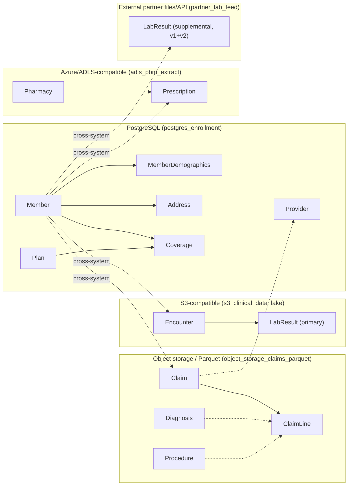

# Tutorial 02 — The synthetic healthcare data estate

This tutorial is a walkthrough of real, runnable code (unlike Tutorial
01, which is a design walkthrough of not-yet-built behavior). It explains
`data_plane.reference_data`, the package that generates the SYNTHETIC,
multi-system healthcare data estate every later phase of this platform
builds on.

## Why this exists before anything else

Every later phase — discovery, subsetting, masking, snapshotting, the UI
— needs *something realistic to operate on*. A teaching platform cannot
use real PHI (`DATA_GOVERNANCE.md` Part A), and hand-authored fixtures
don't exercise scale, referential integrity across systems, or the messy
edge cases a real production estate actually has. So this phase builds a
fake-but-realistic estate first: fake members, their coverage, claims,
clinical encounters, labs, and prescriptions, spread across five
heterogeneous simulated source systems, the way a real large healthcare
organization's data actually would be.

## The five source systems, and why each entity lives where it does



See `services/data-plane/src/data_plane/reference_data/README.md` for the
full entity-by-entity rationale table and the edge-case catalog — this
tutorial focuses on *using* the generator, not repeating that reference.

## Running it yourself

```bash
cd services/data-plane
pip install -e ".[dev]"
python -m data_plane.reference_data.cli --scale tiny --out-dir data/tmp/synthetic-estate
```

This prints row counts and writes the estate under
`data/tmp/synthetic-estate/` (already covered by `.gitignore`'s
`data/tmp/` rule — generated output, even synthetic, is never committed).
Open `manifest.json` in that directory to see exactly how many rows were
generated per entity and how many of each edge case were injected in that
run.

## Two kinds of referential integrity, on purpose

Read `coverage.member_id`/`coverage.plan_id` in the generated SQLite
database (or a real Postgres instance, once you point `--database-url` at
one) and every value resolves — those are real, enforced foreign keys.
Now read `claim.member_id` from the claims warehouse Parquet files against
`member.member_id` in the enrollment database: *most* resolve, but a
deliberate few don't. That's not a bug — it's the platform's core
teaching point made concrete: a real enterprise cannot put a foreign key
constraint across a Postgres database and an S3 bucket, so cross-system
referential integrity has to be a **logical contract the producing
process upholds**, not something the storage layer enforces for you. See
`docs/adr/0006-deterministic-masking-strategy.md` for why this matters
enormously once masking (Phase 9-10) has to keep those same joins working
after every identifier has been replaced.

## What to look at next

- `services/data-plane/src/data_plane/reference_data/generator.py` — the
  actual generation logic, entity by entity.
- `services/data-plane/src/data_plane/reference_data/edge_cases.py` — the
  configurable rates behind every injected data-quality problem.
- `services/data-plane/tests/reference_data/` — the test suite; running
  it (`pytest`) is the fastest way to see the estate's guarantees stated
  as assertions rather than prose.
