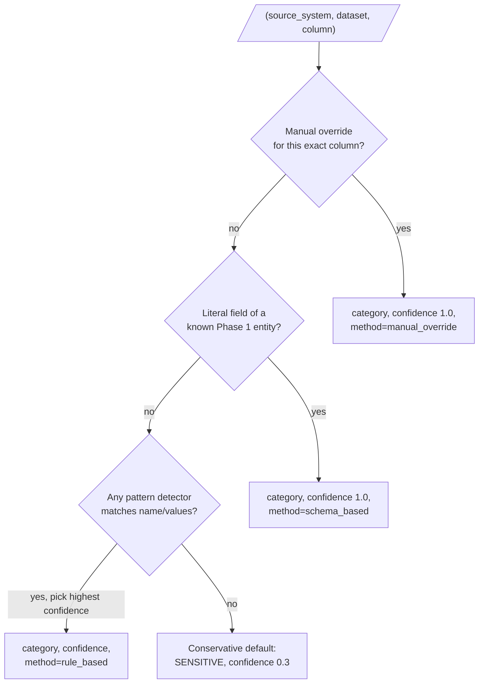

# Tutorial 03 — PHI/PII discovery and classification

This tutorial walks through real, runnable code:
`data_plane.discovery`, the package that classifies every column of the
Phase 1 synthetic estate (Tutorial 02) as a `SensitivityCategory` and
serves the result as a data catalog through the control plane.

## Why this comes right after the synthetic estate

Every later phase — subsetting, masking, synthetic generation,
certification — needs to know *what it's looking at*. A masking engine
can't decide how to transform a column until something has told it "this
is a direct identifier" or "this is non-sensitive." That's discovery's
job: read the estate, decide what every column *is*, and record *why*
with enough confidence/reason metadata that a human can check the work.

## Three layers, one precedence order



A human data steward's decision (`overrides.py`) always wins. Failing
that, an explicit schema entry (`schema_rules.py` — every field of all 14
Phase 1 entities was classified by hand, once) wins over a guess. Failing
that, the best-matching pattern detector (`pattern_rules.py`) applies.
Failing *that* — nothing recognized this column at all — the engine never
assumes a column is safe; it defaults to `SENSITIVE` at low confidence,
per `DATA_GOVERNANCE.md` B.1's "nothing is treated as safe to leave
unmasked purely on an automated classifier's say-so" rule.

## Try it yourself

```bash
cd services/data-plane

# 1. Generate a small estate (Tutorial 02):
python -m data_plane.reference_data.cli --scale tiny --out-dir data/tmp/synthetic-estate

# 2. Classify it:
python -m data_plane.discovery.cli --estate-dir data/tmp/synthetic-estate \
    --out data/tmp/synthetic-estate/catalog.json
```

You'll see output like:

```
Scanned 141 columns across 5 source systems.
Catalog written: data\tmp\synthetic-estate\catalog.json
By category:
   direct_identifier: 20
       non_sensitive: 53
                 phi: 18
                 pii: 7
    quasi_identifier: 35
           sensitive: 8
Flagged for steward review (confidence < 0.7, unconfirmed): 4
```

Open `catalog.json` and look for `"dataset": "claim"`. You'll find *both*
`paid_amount` (the legacy claims-warehouse batch's column name,
classified by the schema layer) and `amount_paid` +
`adjustment_reason_code` (the current-quarter batch's renamed/new
columns, classified by the rule-based layer and a manual override,
respectively) — real proof that the engine ran against the actual files
on disk, schema drift and all, not just against what
`reference_data/domain.py` says the schema *should* be. See
`services/data-plane/src/data_plane/discovery/README.md`, "Why some
columns are only caught by the pattern layer," for the full story.

## A worked example: why the same field name can mean two different things

`Diagnosis.diagnosis_code` and `ClaimLine.diagnosis_code` have the same
column name. The catalog classifies them differently:

| Entity | Column | Category | Why |
|---|---|---|---|
| `Diagnosis` | `diagnosis_code` | `non_sensitive` | A free-standing code-vocabulary row. Knowing that code "SYN-ICD-10-E11.9" means "Type 2 diabetes without complications" reveals nothing about any specific person. |
| `ClaimLine` | `diagnosis_code` | `phi` | This row's code, joined (via `claim_id`) to a specific claim and therefore a specific member — a clinical fact about a real (synthetic) person's care. |

This is why `schema_rules.py` is keyed by `(entity, column)`, not by
column name alone — see `schema_rules.py`'s module docstring for more.

## Manual overrides: correcting the engine, both directions

`manual_overrides.yaml` ships with two worked examples:

1. **Raising** a classification: `Provider.specialty` is ordinary
   provider-directory metadata by column definition, but a data steward
   who looked at the actual generated values noticed `"Behavioral
   Health"` among them and decided the column deserves conservative
   handling — a judgment call about *values*, not names, that no
   automated layer here can make on its own.
2. **Lowering** a classification: `adjustment_reason_code` matches no
   schema entry and no pattern detector, so the engine's own
   conservative default applies (`SENSITIVE`, confidence 0.3). A steward
   who actually knows the claims-adjudication domain confirmed it's a
   harmless internal reason code and downgraded it to `non_sensitive`.

Every override requires a `confirmed_by` identity and a `reason` — that
file *is* the audit trail for "who decided this and why."

## The data catalog, end to end

`catalog_builder.py` turns each classified column into a `CatalogEntry`:
classification (dataset, column, category, tier, confidence, reason) +
`masking_requirement` (a default preview of how Phase 3's masking engine
would treat this tier — not itself an enforced policy yet) + `owner`
(which team's data this is) + `retention_classification` (how long
test-data derived from it is expected to live). The control plane reads
this catalog and serves it:

```bash
export TDM_CONTROL_PLANE_CATALOG_PATH="$(pwd)/data/tmp/synthetic-estate/catalog.json"
cd ../control-plane
uvicorn control_plane.main:app --reload
```

```bash
curl http://127.0.0.1:8000/api/v1/catalog/summary
curl "http://127.0.0.1:8000/api/v1/catalog?category=direct_identifier"
curl "http://127.0.0.1:8000/api/v1/catalog?needs_review=true"
curl http://127.0.0.1:8000/api/v1/catalog/datasets
curl http://127.0.0.1:8000/api/v1/catalog/postgres_enrollment/member/ssn
```

See [ADR-0009](../adr/0009-catalog-artifact-handoff.md) for why this is a
JSON-file handoff between the data plane and control plane today, rather
than a shared database row — the short version is that the real
metadata-plane PostgreSQL schema (ADR-0004) doesn't exist until a later
phase, and the control plane is not allowed to import the data plane's
package to work around that (ADR-0003).

## Before you trust any of this output

Read **`docs/PHI_PII_CLASSIFICATION_LIMITATIONS.md`** in full. The short
version: this is a triage tool, not a HIPAA compliance guarantee. It has
no semantic understanding, essentially no free-text/NLP coverage, and no
cross-column re-identification risk scoring. Every classification's
`confidence` and `needs_review` fields exist so a human stays in the
loop — that is the actual safety mechanism, not the regex.
