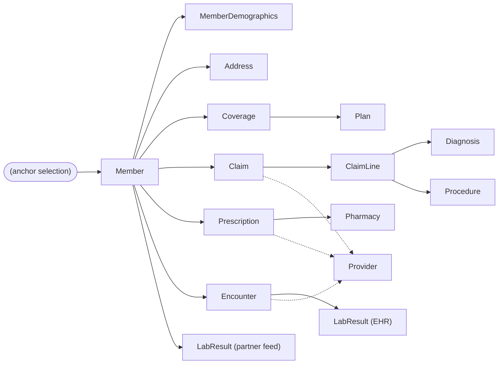

# Tutorial 04 — Subsetting and referential closure

This tutorial walks through real, runnable code: `data_plane.subsetting`,
the package that selects a smaller, representative population from the
Phase 1 synthetic estate (Tutorial 02) while guaranteeing that every
relationship a selected row participates in is either fully present in
the subset or provably, legitimately absent.

## Why this comes right after discovery and masking

Discovery (Tutorial 03) answers "what is this column?" Masking (Phase 3)
answers "how should this value be transformed?" Neither one changes *how
many rows* end up in a lower environment. That's this phase's job: a real
production estate can be millions of members and hundreds of millions of
claims — far too large, slow, and expensive to copy wholesale into every
dev/test/QA/perf environment. Subsetting selects a much smaller population
that is still *useful*: still has the shape, edge cases, and relationships
real production data has, just fewer of them.

The naive way to do this — `SELECT * FROM member LIMIT 100`, then
separately `SELECT * FROM claim LIMIT 100` — is wrong. It produces claims
that reference members outside your 100, coverage records with no member,
lab results with no encounter. That is not a smaller version of your
production data; it is broken data that will make every test built on top
of it unreliable. The requirement this phase exists to satisfy is
**referential closure**: once you decide *who* is in the subset, every
row that legitimately belongs to that population — across every table,
across every one of the five simulated source systems — must come along
with it, and nothing that belongs to someone else should.

## The graph, and where it lives in the code



Solid arrows are "child belongs to selected parent" (Member owns their own
Coverage, Claims, Encounters, ...). Dashed arrows are "referenced by,
trimmed to what's used" — Provider is a shared directory, not owned by any
one member, so the subset keeps only the providers actually referenced by
a selected Claim, Encounter, or Prescription, the same way Diagnosis and
Procedure code tables are trimmed to only the codes a selected ClaimLine
actually uses.

This entire graph is implemented in one function:
`data_plane.subsetting.closure.build_closure`. It takes a set of selected
Member IDs and walks every edge above, in order, building up the selected
row sets for every entity across all five source systems (the
PostgreSQL-shaped enrollment database, the claims Parquet warehouse, the
S3-style clinical NDJSON lake, the ADLS-style PBM CSV extract, and the
partner lab feed's two file shapes). It is the *only* place in this
package that knows about relationships.

## The six strategies only decide *who*

`data_plane.subsetting.selection` implements six functions, one per
`SubsettingStrategy`. Every one of them returns nothing but a set of
Member IDs:

| Strategy | What it selects | Real parameter example |
|---|---|---|
| `percentage` | A random N% of the member population | `percentage=25` |
| `fixed_population` | An exact target count (capped at what's available) | `count=8` |
| `stratified` | Up to N members from every distinct value of a field (e.g. every gender) | `strata_field=gender, per_stratum=3` |
| `date_window` | Members with >=1 claim whose `service_date` falls in a range | `start_date=2025-01-01, end_date=2025-03-31` |
| `business_rule` | Members matching a predicate (e.g. active coverage + a paid claim) | `coverage_status=active, claim_status=paid, min_matching_claims=1` |
| `risk_edge_case` | Members that touch a known Phase 1 injected edge case | `max_members=10` (optional) |

None of these six functions ever look at `Coverage`, `Claim`, `Provider`,
or anything else beyond what they need to decide membership (e.g.
`date_window` reads `Claim.service_date`, but only to decide *which
members* qualify, never to decide which claims are pulled in — that's
`build_closure`'s job, applied identically no matter which strategy
produced the anchor set). This split is deliberate: it means there is
exactly one referential-integrity implementation to get right, not six.

## Reachable vs. unreachable orphans

The Phase 1 estate deliberately injects orphan records (see
`reference_data/edge_cases.py`) — for example, a `Claim.provider_id` that
points at a provider that was never created, or a `ClaimLine.diagnosis_code`
that points at a code that doesn't exist in the `Diagnosis` reference
table. When one of these orphaned rows is genuinely owned by a *real,
selected* member, it comes along in the subset and the orphan is
preserved and reported — a subset should faithfully represent the
messiness of the source estate, not quietly clean it up.

But some of the estate's injected orphans work differently: an orphan
`Address` row, for example, is written with a `member_id` that points at
a member that **does not exist at all**. That address isn't "owned by a
member who wasn't selected" — it isn't owned by anyone, real or selected.
Since every entry point into this package starts from a set of *real*
Member IDs and only pulls in rows whose foreign key matches one of them,
that kind of orphan can never be reachable from any selection, no matter
how large. The same is true of `Claim.member_id` orphans, `Prescription.
member_id` orphans, the phantom-`claim_id` `ClaimLine` orphans, and the
partner feed's not-yet-enrolled `member_id` records.

| Orphan category | Reachable from a Member-anchored subset? | Why |
|---|---|---|
| `claim.provider_id` -> nonexistent provider | **Yes** | The Claim itself belongs to a real member |
| `encounter.provider_id` -> nonexistent provider | **Yes** | The Encounter itself belongs to a real member |
| `claim_line.diagnosis_code` -> nonexistent code | **Yes** | The ClaimLine's parent Claim belongs to a real member |
| `address.member_id` -> nonexistent member | No | The Address row itself belongs to no one |
| `claim.member_id` -> nonexistent member | No | The Claim row itself belongs to no one |
| `prescription.member_id` -> nonexistent member | No | The Prescription row itself belongs to no one |
| `claim_line.claim_id` -> nonexistent claim | No | The ClaimLine row itself belongs to no claim, real or otherwise |
| partner feed `member_id` (not yet enrolled) | No | The lab result belongs to no enrolled member |

`services/data-plane/tests/subsetting/test_closure.py::
test_closure_never_introduces_a_new_dangling_reference` proves this
holds even when *every* member in the estate is selected (the largest,
most orphan-exposing case possible): every dangling reference the closure
walk finds traces back to a pre-existing source orphan, never a bug in
`build_closure` itself.

## What integrity validation actually checks

`data_plane.subsetting.validation.validate_subset` turns every dangling
reference `build_closure` found into one of three outcomes
(`healthcare_tdm_contracts.IntegrityStatus`):

- **`PASSED`** — no dangling references at all.
- **`PASSED_WITH_KNOWN_ORPHANS`** — one or more dangling references were
  found, but every one of them is either a pre-existing source orphan
  (see above) or an intentional negative-test injection (see below).
  Still a valid, publishable subset.
- **`FAILED`** — a dangling reference was found whose target *did* exist
  in the source estate's parent table but was not carried into the
  subset. This is a real defect in selection/closure logic and must never
  happen; `problems_phase_04.md` tracks this as a hard requirement, not
  an aspiration.

The verdict is per-run, but the findings are per-relationship, so a
`SubsetManifest` never just says "there were orphans" — it says exactly
which relationship, how many, and which of the three categories.

## Intentional negative testing

Sometimes a downstream consumer *wants* a subset with a known broken
reference, to test that their own code handles one correctly, rather than
waiting for a rare edge case to show up in a random sample.
`data_plane.subsetting.negative_testing.inject_negative_test_orphan` is
the explicit, opt-in mechanism for that: it removes a selected `Provider`
row that one or more selected `Claim`s still reference, and tags the
resulting dangling reference `category="negative_test_injection"` so
`validate_subset` reports it distinctly from both a real bug and a
coincidental source orphan. It is never invoked unless a caller explicitly
asks for it (`--negative-test` on the CLI, or `negative_test=True` on
`run_subsetting`).

## Try it yourself

```bash
cd services/data-plane

# 1. Generate a small estate (Tutorial 02) if you don't have one yet:
python -m data_plane.reference_data.cli --scale tiny --out-dir data/tmp/synthetic-estate

# 2. Select a fixed population of 8 members:
python -m data_plane.subsetting.cli --estate-dir data/tmp/synthetic-estate \
    --out-dir data/tmp/synthetic-estate-subset \
    --strategy fixed_population --param count=8
```

Real output from exactly this command, against a real generated `tiny`
estate (seed `20240101`):

```
Strategy: fixed_population -- Fixed population of 8 requested; 26 available; 8 selected
Subset written: data\tmp\synthetic-estate-subset
Row counts (source -> selected):
               address:      38 -> 12
                 claim:      53 -> 16
            claim_line:      92 -> 26
              coverage:      36 -> 11
             diagnosis:      30 -> 18
             encounter:      39 -> 13
            lab_result:      55 -> 13
                member:      26 -> 8
   member_demographics:      24 -> 8
              pharmacy:       5 -> 4
                  plan:       6 -> 6
          prescription:      43 -> 12
             procedure:      30 -> 16
              provider:      10 -> 10
Relationship edges traversed:
  (selection) -> Member: 8
  Member -> MemberDemographics: 8
  Member -> Address: 12
  Member -> Coverage: 11
  Coverage -> Plan: 6
  Member -> Claim: 16
  Claim -> ClaimLine: 26
  ClaimLine -> Diagnosis: 18
  ClaimLine -> Procedure: 16
  Member -> Prescription: 12
  Prescription -> Pharmacy: 4
  Member -> Encounter: 13
  Encounter -> LabResult (EHR): 12
  Member -> LabResult (partner feed): 1
  Claim/Encounter/Prescription -> Provider: 10
Estimated storage: source=131,764 bytes, subset=70,640 bytes
Integrity status: passed_with_known_orphans
  OK   coverage.plan_id: 0 dangling references (fully closed)
  OK   claim_line.diagnosis_code: 0 dangling references (fully closed)
  OK   claim_line.procedure_code: 0 dangling references (fully closed)
  OK   prescription.pharmacy_id: 0 dangling references (fully closed)
  OK   lab_result.encounter_id: 0 dangling references (fully closed)
  OK   claim.provider_id: 0 dangling references (fully closed)
  OK   encounter.provider_id: 1 pre-existing source orphan(s) legitimately present in this subset (Phase 1 edge case, not a defect)
  OK   prescription.prescriber_provider_id: 0 dangling references (fully closed)
Manifest: data\tmp\synthetic-estate-subset\subset_manifest.json
```

Notice `member: 26 -> 8` (exactly the requested population) alongside
`provider: 10 -> 10` (every provider happened to be referenced at this
small a scale — at real production scale this ratio would be far more
selective) and `encounter.provider_id: 1 pre-existing source orphan(s)`
(one of the 8 selected members happened to have an encounter referencing
Phase 1's deliberately-injected nonexistent provider `SYN-PRV-99998`,
carried through and reported, not hidden).

Open `data/tmp/synthetic-estate-subset/subset_manifest.json` and you'll
find the exact same information in the durable, typed
`healthcare_tdm_contracts.SubsetManifest` shape: source counts, selected
counts, every relationship edge traversed with its count, the resolved
filter criteria, a timestamp and version, estimated storage in bytes for
both the source and the subset, and the integrity status with per-
relationship findings.

## Scaling this to a real 10,000-member subset

Nothing in this package hardcodes population size. `fixed_population`
with `count=10000` against a `performance`-scale estate (20,000 members,
`ROADMAP.md`/`reference_data/scale.py`) runs the exact same code path
demonstrated above at `tiny` scale (26 members) — `build_closure` doesn't
know or care how many Member IDs it was handed. The example above uses a
small scale profile only because that's what fits in this repository's
test/CI budget; see `problems_phase_04.md` for the tracked follow-up on
benchmarking this at real `qa`/`performance` scale (Phase 14).

## Before you trust any of this output

A subset is only as complete as the relationships `closure.py` knows
about. This phase's graph covers every relationship the Phase 1
promptbook's own example names (Member -> Coverage -> Claim -> ClaimLine
-> Diagnosis/Procedure; Claim -> Provider; Member -> Prescription ->
Pharmacy; Member -> Encounter -> LabResult) plus the two additional real
relationships the estate itself has (Coverage -> Plan, Encounter/
Prescription -> Provider). A future source system with a relationship
this graph doesn't know about would need a new edge added to
`build_closure` — it does not discover relationships automatically from
the data the way `discovery`'s pattern layer discovers columns. See
`problems_phase_04.md` for this and other known limitations.
