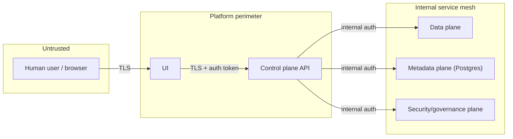

# Chapter 2 — Why regulated enterprises need TDM

## The blunt version

A hospital network, health insurer, or PBM (pharmacy benefit manager)
runs dozens of lower environments — dev, test, QA, performance, UAT,
sandbox — because software has to be built and tested somewhere before
it reaches production. Every one of those environments needs data. If
that data is a real patient's real record, that lower environment is
now subject to the same regulatory obligations (HIPAA in the US, and
equivalents elsewhere) as production — but almost never has production's
access controls, monitoring, encryption, or staff discipline, because
"it's just test" makes people careless. `docs/tutorial/00-overview.md`
states this plainly: copying real production data into test is "the
single most common real-world cause of healthcare data breaches that
have nothing to do with sophisticated attackers."

A regulated enterprise needs TDM not as a nice-to-have engineering
practice, but because the alternative — real PHI/PII sitting in a
poorly-secured lower environment — is a real, recurring, expensive,
and reputation-destroying failure mode. TDM is the discipline that lets
an organization say, with evidence, "our lower environments never held
real patient data in the first place," which is a categorically
stronger position than "we tried to secure the copies we made."

## What "regulated" actually adds, concretely

It is not just "we should be careful." Regulation adds three concrete
requirements this platform is built around:

1. **Provable classification.** An organization must be able to show,
   for every column of every dataset, whether it is PHI, PII, or
   neither — not just assert it. That's Chapters 3, 5, and 6 of this
   guide, and `data_plane.discovery`.
2. **Provable protection.** For any column that *is* sensitive, there
   must be evidence a real transformation was applied before it left
   production — not just a claim that "masking happened." That's
   Chapters 9, 10, and 12, and `data_plane.masking` +
   `data_plane.certification`.
3. **Provable history.** An auditor must be able to reconstruct who
   requested what, what was approved, what was published, and when —
   after the fact, not just at the time. That's Chapter 19, and
   `control_plane.platform.audit` / `control_plane.domain.evidence`.

`SECURITY.md` names these three properties directly under "Security
principles this platform is designed to demonstrate": defense in depth
(classification, masking, and certification as three *independent*
checks — a failure in one does not silently bypass the others),
immutable audit evidence, and certified-before-published. None of the
three is optional in a regulated environment; each is missing a
concrete regulatory answer without it.

## The threat model, briefly

`THREAT_MODEL.md` runs a STRIDE analysis (Spoofing, Tampering,
Repudiation, Information disclosure, Denial of service, Elevation of
privilege) across every plane. Two assets it names explain most of why
this platform is shaped the way it is:

- **"The masking key/salt material"** — if this leaks, every masked
  value in every lower environment becomes reversible (see Chapter 10).
- **"Certification evidence"** — if this can be forged, a dataset could
  be presented as safe when it is not (see Chapter 12).

(Reproduced from `THREAT_MODEL.md` section 2 — read that document in
full for the per-plane STRIDE breakdown.)

## What this repository is honest about *not* being

This repository is a portfolio/teaching project, not a production
deployment (`SECURITY.md`, first paragraph). It builds every mechanism
a regulated enterprise needs to a real, runnable, tested standard — but
it never claims that running this code makes an organization HIPAA
compliant. `docs/COMPLIANCE_EVIDENCE.md` (see Chapter 19) says this most
explicitly: the Audit Evidence Package this platform produces "is
evidence in support of an organization's own privacy/security/
compliance program. It is not itself a HIPAA (or any other regulatory)
certification, attestation, or guarantee." That distinction — *building
the real mechanisms an audit would check for*, versus *claiming to be
the audit itself* — is a theme that recurs in nearly every "what this
does and does not cover" section across this repository's docs, and
it's worth internalizing now: a good TDM platform earns trust by being
honest about its own limits, not by overclaiming.

## Where to go next

Continue to [Chapter 3 — PHI vs PII](03-phi-vs-pii.md).
