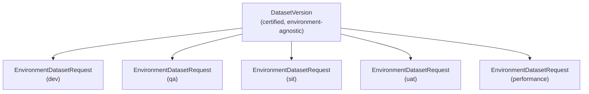

# Chapter 4 — Production vs lower environments

## The concept

**Production** is the environment real users/patients/claims actually
flow through, where a bug or outage has a real, immediate consequence.
**Lower environments** are everything else software passes through
before it reaches production: development, integration/system testing,
QA, performance/load testing, UAT (user acceptance testing), and
sandbox/demo environments. Every lower environment needs data that
behaves like production data — realistic volumes, realistic edge cases,
realistic relationships — without being production data, for exactly
the reasons Chapters 1 and 2 of this guide cover.

This repository's contracts encode this list of lower environments as
a real, typed enum, not a string a caller could misspell:

```python
# libs/contracts/src/healthcare_tdm_contracts/lifecycle.py
class Environment(str, Enum):
    DEV = "dev"
    QA = "qa"
    SIT = "sit"
    UAT = "uat"
    PERFORMANCE = "performance"
```

Every environment in this enum is a *lower* environment — this
repository has no `PRODUCTION` value here on purpose. `DatasetVersion`
(the thing this platform produces and certifies) never has a "this is
the production copy" flag; it is deliberately environment-agnostic (see
Chapter 13), and only ever gets *requested into* a lower environment via
an `EnvironmentDatasetRequest`. Production, in this platform's own
architecture, is the untouched source system every pipeline in Chapter 1
starts from — the platform's job is entirely about what happens on the
way *out* of it, into somewhere lower-risk.

## Why lower environments differ from each other, not just from production

A junior engineer's first instinct is often to treat "not production"
as one bucket. This repository's real code treats each lower
environment as having genuinely different needs, expressed as a
different `RefreshCadenceType` per environment
(`healthcare_tdm_contracts.lifecycle`):

| Environment | Typical cadence | Why |
|---|---|---|
| `dev` | `weekly` | Fast iteration; staleness tolerated |
| `qa` | `weekly` | Needs to track dev closely for regression testing |
| `sit` | `biweekly` | Integration testing across systems, less churn needed |
| `uat` | `release_driven` (no fixed schedule) | Business stakeholders need a *stable* dataset tied to a release, not a moving target |
| `performance` | `monthly` | Performance testing needs a large, stable dataset; refreshing it is expensive and disruptive |

This is not a hypothetical table — it is real output from a real run of
`scripts/demo_phase7_lifecycle.py`, reproduced in
`docs/tutorial/07-dataset-lifecycle-and-refresh.md`:

```
STEP 5 -- Refresh cadence computed per environment
           dev: cadence=weekly          next_refresh_at = requested_at + 7 days
            qa: cadence=weekly          next_refresh_at = requested_at + 7 days
           sit: cadence=biweekly        next_refresh_at = requested_at + 14 days
           uat: cadence=release_driven  next_refresh_at = None (no fixed schedule)
   performance: cadence=monthly         next_refresh_at = requested_at + 30 days
```

## The one dataset, many environments model

`control_plane.domain.lifecycle` (Chapter 13 covers this in depth) makes
a specific architectural choice worth understanding now: a
`DatasetVersion` is one immutable, certified artifact; each environment
that wants it gets its own `EnvironmentDatasetRequest` row pointing at
the *same* `DatasetVersion` by foreign key. Five environments requesting
the same certified dataset therefore reference one physical copy, not
five — real, measured savings covered in Chapter 15 (Capacity planning).



## Where to go next

Continue to [Chapter 5 — Data profiling](05-data-profiling.md), or
jump ahead to
[Chapter 13 — Snapshots and refresh cadence](13-snapshots-and-refresh-cadence.md)
and `docs/tutorial/07-dataset-lifecycle-and-refresh.md` for the full
implementation depth on everything this chapter introduced.
