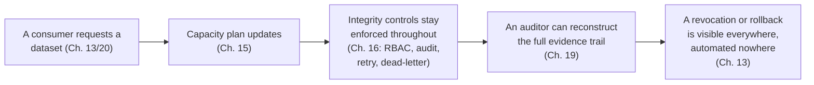

# Chapter 20 — Operating TDM as a product

## The concept, and an honest note on this chapter

Every chapter before this one covered a *capability*: classify, subset,
mask, certify, publish, plan capacity, enforce integrity, prove audit
evidence. "Operating TDM as a product" is a different kind of question:
once all of that exists, what does it mean to *run* it, day to day, for
many teams, over time, the way a real platform team operates any other
internal product — with consumers who have SLAs, capacity that has to
be planned and reclaimed, a governance model that scales past one team,
and a process that keeps the system honest about its own gaps? This
repository never built one module named `product` or `operations` — so
rather than invent unbuilt functionality, this chapter is an explicit
**synthesis** of real, already-built material across five phases plus
the repository's own development process. If you're looking for a
single file that "is" this chapter's subject, there isn't one; the
subject is the pattern connecting Chapters 13, 15, 16, and 19 of this
guide, plus how this repository builds itself.

## What "many consumers, one governed standard" looks like in practice

Chapter 9 covered *how* masking works. It doesn't cover the organizational
problem a real platform team faces immediately once more than one team
uses it: two organizational arms (this repository's own worked example
names them `LEFT_ARM` and `RIGHT_ARM`) will legitimately want different
things — different subset sizes, different refresh cadences, different
environments — but must **not** be allowed to each define their own
masking rules for sensitive fields, or the platform's entire value
proposition collapses into two uncoordinated, unauditable pipelines.
`control_plane.domain.governance` makes this structural, not just
conventional: `ConsumerDatasetRequest` has no field that could carry a
masking rule, technique, or policy override at all — the only
masking-policy reference is a foreign key to an *already-approved*
`MaskingPolicyVersion`. Real output from
`scripts/demo_phase10_governance.py`:

```
STEP 9 -- Adversarial: a consumer cannot bypass governance with an unapproved policy version
  RIGHT_ARM drafts its OWN policy revision (status=draft) -- still not approved.
  Attempt rejected: HTTP 409 -> MaskingPolicyVersion ... has approval_status='draft', not 'approved'...
```

That 409 is what "operating as a product with a governed standard"
means in code, not in a policy document nobody can verify against
running software.

## When one consumer's demand becomes real capacity, not a side conversation

Chapter 15 covered capacity planning as a measurement. The product
question is: when `RIGHT_ARM` asks for additional QA capacity, does
that become a new, parallel bookkeeping system, or does it flow into
the platform's *existing* refresh calendar and capacity plan?
`GovernanceRepository.fulfill_consumer_request` answers this by
composing `LifecycleRepository` in the same transaction and calling
straight into Chapter 13's real, unmodified `request_environment`. Real,
measured before/after from the same demo script:

```
STEP 6 -- Real Phase 8 capacity plan BEFORE RIGHT_ARM's additional QA capacity request
  environment_count=2  distinct_dataset_version_count=2  shared_total_storage_bytes=173105
STEP 8 -- Real Phase 8 capacity plan AFTER: RIGHT_ARM's QA demand is now visible
  environment_count=3 (was 2)
  This demand was produced entirely by Phase 7/8's existing, unmodified machinery.
```

No new capacity-accounting code was written to make this true — there
was nothing to write, because the underlying architecture already
generalized.

## The operating loop: request -> plan -> integrity -> evidence

Put together, Chapters 13, 15, 16, and 19 form the actual operating
loop a platform team runs, day to day, once this system is live:



Every arrow in that diagram is a real, tested code path this guide has
already shown running, not a conceptual aspiration.

## The other half of "operating as a product": operating the *build*, not just the running system

This repository's own development process is itself a real answer to
"how do you operate a system like this responsibly over time," and it's
worth naming explicitly because a junior engineer joining this project
inherits this process, not just this codebase:

- `ROADMAP.md` tracks what's done and what's next, phase by phase, with
  an honest "what was actually delivered" section per phase — including
  this one.
- `CONTRIBUTING.md`'s eight-step process (inspect first, write down
  expected problems *before* implementing, implement, test, document,
  remove resolved problems, leave unresolved problems with repro
  details, never declare done with failing tests) is exactly how every
  phase this platform is built from — including the one that wrote this
  chapter — actually proceeded.
- `problems_master.md` and the per-phase `problems_phase_NN.md` files
  are the running, honest record of what's known-broken or
  known-incomplete right now — read at the start of any new work, not
  written once and forgotten.

A platform that is honest about its own open problems, in a durable,
readable place, is itself a product-operations practice — arguably the
one every earlier chapter in this guide has been quietly demonstrating
the whole time, every time it named a real, open `problems_phase_NN.md`
entry instead of glossing over a gap.

## Where to go from here

You've now read all twenty chapters. From here:

- Re-read `docs/tutorial/00-overview.md` and `ARCHITECTURE.md` — they
  will make considerably more sense now than on a first pass.
- Pick one chapter's linked implementation-depth document (the `0X`/`13`
  chapters, or the ADRs/docs each guide chapter names) and actually run
  its worked example yourself.
- Read `problems_master.md` and the most recent `problems_phase_NN.md`
  to see exactly what's open right now — that's where real next work
  starts.
